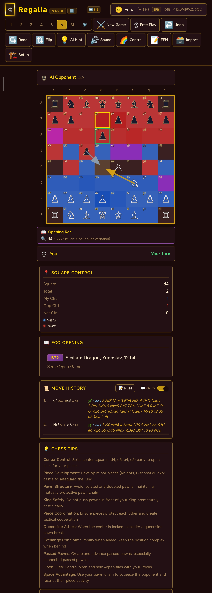

# Regalia ♔

<!-- AI-GEN: AI assisted
     This document was AI-assisted and has been reviewed for AGPL v3 compliance. -->

A standalone, open-source chess app for Android — play offline against Stockfish 18, analyze your games, and explore openings. No account, no network, no tracking. Now with **Chess960 (Fischer Random Chess)** support (v1.0.4).

"Regalia" is used solely as a project name for this open-source chess app. No trademark rights are claimed. Anyone is free to fork and rename their own version.

## Screenshots

<p align="center">
  
</p>

Portrait mode — evaluation bar, move history, AI opponent display with ponder info, and Control heatmap. See the user manual (`Manual/Regalia-v1.1.0-manual-{zh,en}.html`) for wireframe diagrams of every screen.

**Control Heatmap** — Tap the 🌗/🌈 button on the toolbar to toggle the control heatmap. Each square is dynamically colored by HSL to indicate which side controls it: blue-purple = your control, red = opponent's control, purple = contested. Hovering a square shows SVG arrows from each controlling piece to that square (warm gold for your pieces, cool silver-blue for opponent's). The info card below the board shows per-piece control contributions with position labels.

**🌿Line** — In the move record, 🌿 lines appear below each move showing engine analysis variations (MultiPV) and PGN import variations (RAV). Each variation is labeled 🌿Line 1, 🌿Line 2, etc., assigned sequentially by display order. PGN import variations are automatically parsed and displayed as 🌿Lines with proper move numbering. Toggle the Variations switch to show or hide them.

## Features

- **Stockfish 18 Engine** — arm64-v8a-dotprod variant (ARMv8.6-A DOTPROD instructions for NN inference acceleration) for optimal performance on modern devices
- **Chess960 / Fischer Random Chess** (v1.0.4 NEW) — full support for the 960 starting positions with proper castling rules, SP-ID selector in New Game dialog, Shredder-FEN castling rights, and `UCI_Chess960` engine option
- **Standardized PGN** (v1.0.4 NEW) — import/export follows the 1994 PGN spec strictly: Seven-Tag Roster always emitted, `[%eval]` / `[%clk]` / `[%emt]` annotations embedded, Result terminator enforced, tolerant parser auto-corrects malformed input
- **NAG &amp; Visual Annotations** (v1.0.4 NEW) — NAG ($1-$19) support; automatic selection &amp; caching of `[%csl ...]` (square highlights) and `[%cal ...]` (arrows) per move: Square highlights — Blue=player net-control strong squares, Red=AI net-control strong squares, Yellow=high total-control squares, Green=neutral center squares; Arrows — Blue=multi-threat (one piece threatens 2+ enemy pieces), Red=check path, Yellow=queen-threat path, Green=escape squares
- **Time-Control Chess** (v1.0.4 NEW) — Sudden Death / Fischer Increment / Bronstein Delay / US Delay modes; live clock display with low-time warning; auto-emits `[TimeControl "..."]` header and `[%clk HH:MM:SS]` per-move annotations; for untimed games, emits `[%emt HH:MM:SS]` (elapsed move time)
- **Web Worker Pool** (v1.0.4 NEW) — `worker-pool.js` offloads PGN parsing, statistics computation, and control-map computation to a background thread; falls back to inline execution on devices without Worker support
- **8 Difficulty Levels** — from beginner (800 ELO) to maximum strength (2800+ ELO), plus Skill Level mode
- **PGN Import** — paste PGN from clipboard, or select a PGN file from your device
- **Review Mode** — full game replay with evaluation trend chart, move-by-move analysis, move classification (brilliant/good/blunder), and engine evaluation cache
- **MultiPV Analysis** — 1–8 lines of analysis simultaneously
- **ECO Opening Classification** — 500+ standard openings with search, category filtering, and book move recommendations
- **Syzygy Endgame Tablebases** — 7-piece endgame lookup via Lichess Tablebase API (requires network; auto-disables when offline)
- **Position Setup** — custom board editing with FEN copy/import
- **Ponder Mode** — engine thinks on opponent's time for stronger play
- **WDL Display** — Win/Draw/Loss probability shown alongside evaluation
- **Heatmap Control Statistics** (v1.0.4 NEW) — per-square average control across all positions, strongest/weakest square detection, center-control trend
- **Board Anti-Shake** (v1.0.5 NEW) — `StabilizationHelper.java` fuses `TYPE_LINEAR_ACCELERATION` sensor data with an OIS-style translation-compensation algorithm to keep the board visually stable when the device is held in an unsteady hand; auto-adapts to all 4 screen rotations and to notch/cutout/R-corner screens
- **Quick Toolbar** (v1.0.7 NEW) — the Undo / Redo / Flip / AI-Hint / Control-Range buttons have been moved from the top header toolbar to a new toolbar directly below the board, where the user's thumb naturally rests
- **Setup-Mode Manual Markers** (v1.0.7 NEW) — 🔁 castle-rights and ⚡ en-passant markers are now placed manually during Setup mode (no auto-grant), validated against the Fischer Random Chess castling rule; markers display in all modes (setup/play/review) and auto-remove when no longer eligible
- **Personified Move Animations** (v1.0.8 NEW) — Each piece has a unique personified motion characteristic via Web Animations API: ♙ pawn (timid, hesitate-back then dart, 250ms), ♘ knight (agile, L-shape parabolic jump, 380ms), ♗ bishop (sharp, quick diagonal, 270ms), ♖ rook (fierce, charge-dash-impact with light board shake, 290ms), ♕ queen (elegant, graceful arc with heavy board shake, 500ms), ♔ king (solemn, heavy step with heavy board shake, 520ms). GPU-composited via `translate3d` + `will-change:transform` + a single static `filter:drop-shadow` cached on the composited layer — every animation frame is a pure transform update (zero pixel ops), so 120fps is sustained even on mid-range devices.
- **Personified Sound Effects** (v1.0.8 NEW) — `ChessAudioEngine` pure Web Audio API synthesis (no audio files), each piece's timbre matching its animation personality: pawn (triangle 3-stage), knight (sine sweep + ding), bishop (sawtooth + filter sweep), rook (square + noise + impact), queen (3-freq harmony + LFO vibrato), king (bell partials + 4 footsteps). Routing: master → dry+reverb → compressor → destination. Mobile unlock on first gesture; `_activeNodes` auto-clean.
- **Light/Dark Theme** (v1.0.8 NEW) — Light/dark mode switches automatically with the system global setting via dual-channel detection (Java `UiModeManager` + JS `data-theme` attribute + CSS `@media (prefers-color-scheme: light)` / `html[data-theme="light"]`). Light mode uses an elegant silver palette (`#f0f0f3` / `#2c2c34` / `#4a4a52`); dark mode preserves the v1.0.7 warm brown-red + bright gold. The king icon on the loading overlay and main header toolbar switches ♔ (dark mode, white-piece styling) ↔ ♚ (light mode, black-piece styling) to match the on-board pieces.
- **Bilingual UI** — full Chinese/English toggle via the ↔️ button on the toolbar, with automatic system language detection
- **Landscape Support** — adaptive layout for both portrait and landscape orientation
- **Engine Configuration** — full UCI parameter control with export/import
- **Haptic Feedback** — responsive touch feedback throughout the interface

## Download

Download the latest APK from [GitHub Releases](https://github.com/YDW99/Regalia/releases). Enable "Install from unknown sources" to install.

## Requirements

- Android 5.0 (API 21) or later
- ARM64 device (arm64-v8a)
- ~200 MB storage

## Building

### Prerequisites

- JDK 21 (e.g. Temurin JDK 21.0.5+11) — provides `javac`
- Android SDK with API 35 (Android 15), Build-Tools 34.0.0, NDK 27.2.12479018, CMake 3.22.1
- Gradle 8.11.1 (wrapper included)
- Stockfish 18 engine binary for arm64-v8a-dotprod

### Build Steps

1. Download the Stockfish 18 arm64-v8a-dotprod binary from the [official sf_18 release](https://github.com/official-stockfish/Stockfish/releases/download/sf_18/stockfish-android-armv8-dotprod.tar), extract it, and place the binary at:
   ```
   src/main/jniLibs/arm64-v8a/libstockfish.so
   ```
   (The `.so` extension is required by Android's `System.loadLibrary` / `nativeLibraryDir` convention; the file is the Stockfish ELF executable, renamed.)

2. Build the chess.html asset (merges JS modules into the HTML template):
   ```bash
   python3 build-chess.py
   ```

3. Build the APK:
   ```bash
   ./gradlew assembleRelease
   ```

The signed APK will be at `build/outputs/apk/release/`.

## Project Structure

```
Regalia/
├── src/main/
│   ├── assets/
│   │   ├── chess.src/          # Source files (JS + CSS + HTML template)
│   │   │   ├── game-logic.js   # Chess rules, move generation, i18n, castling detection, move animation
│   │   │   ├── chess960.js     # Chess960 SP-ID, Shredder-FEN, 960 castling rules (v1.0.4 NEW)
│   │   │   ├── pgn-standard.js # Standardized PGN encoder/decoder, NAG, [%csl]/[%cal], TimeControl (v1.0.4 NEW)
│   │   │   ├── worker-pool.js  # Web Worker pool for heavy stats computation offloading (v1.0.8 PHASE 25)
│   │   │   ├── ai-bridge.js    # Engine communication, eval display, PGN export, FEN sanitization, theme detection
│   │   │   ├── tablebase.js    # Lichess Syzygy tablebase queries + PGN import
│   │   │   ├── eco-data.js     # ECO opening classification data
│   │   │   ├── ui.js           # Rendering, dialogs, interaction, review mode, castling gesture, ChessAudioEngine
│   │   │   ├── index.html.tpl  # CSS template (theme variables, responsive layout, animation keyframes)
│   │   │   └── README.license  # Per-file license classification for this directory
│   │   ├── chess.html          # Built output (combined JS+CSS+HTML)
│   │   ├── stats.html          # Statistics page (📊统计) — fullscreen WebView
│   │   ├── AGPLv3_Logo.svg     # AGPL logo for About page
│   │   ├── GPLv3_Logo.svg      # GPL logo for 💾HTML export dialog
│   │   └── README.license      # Per-file license classification for this directory
│   ├── java/com/Regalia/
│   │   ├── MainActivity.java   # WebView host, immersive mode, lifecycle, SAF file pickers
│   │   ├── StockfishNative.java # Engine process management, UCI protocol, SAF file I/O, 60+ JS interfaces
│   │   ├── StatsActivity.java  # Fullscreen WebView for 📊统计 statistics page
│   │   ├── ChessWebViewClient.java # Page load handler, render-process crash recovery
│   │   ├── EngineService.java  # Foreground service for engine stability
│   │   ├── ChessApp.java       # Application class, crash protection
│   │   ├── StabilizationHelper.java # Sensor-fusion board anti-shake (v1.0.5 NEW)
│   │   ├── TlsSecurityHelper.java # TLS 1.2+ enforcement for tablebase API
│   │   ├── RootDetector.java   # Informational root detection (About dialog)
│   │   └── README.license      # Per-file license classification for this directory
│   ├── cpp/
│   │   ├── engine_jni.cpp      # JNI native chmod/renice (from DroidFish)
│   │   ├── CMakeLists.txt
│   │   └── README.license      # Per-file license classification for this directory
│   ├── res/
│   │   ├── values/strings.xml  # Application name ("Regalia v1.1.0")
│   │   ├── xml/network_security_config.xml  # TLS + certificate pinning for tablebase API
│   │   ├── xml/backup_rules.xml             # Backup rules (Android < 12)
│   │   ├── xml/data_extraction_rules.xml    # Data extraction rules (Android 12+)
│   │   ├── mipmap-{m,h,xh,xxh,xxxh}dpi/     # Launcher icons (ic_launcher, ic_launcher_round, ic_launcher_foreground)
│   │   └── README.license      # Per-file license classification for this directory
│   ├── AndroidManifest.xml
│   ├── README.license          # Per-file license classification for src/main/
│   └── jniLibs/arm64-v8a/      # (build-time) libstockfish.so — Stockfish 18 engine binary
                                #   NOT in source tarball; download separately and place here
                                #   (see BUILDING.md). Excluded from source distribution
                                #   to keep the tarball small and avoid redistributing the
                                #   114MB engine binary with the source.
├── Manual/                     # User manuals (HTML, self-contained)
│   ├── Regalia-v1.1.0-manual-zh.html  # Chinese user manual (current)
│   ├── Regalia-v1.1.0-manual-en.html  # English user manual (current)
│   └── README.license          # Manual license classification
├── gradle/wrapper/             # Gradle wrapper (8.11.1)
│   ├── gradle-wrapper.jar
│   └── gradle-wrapper.properties
├── NOTICE                      # Third-party component notices + version history
├── NOTICE-DroidFish            # Original DroidFish notice
├── NOTICE-gradle               # Gradle notice (Apache v2.0)
├── AUTHORS-stockfish           # Stockfish project authors list
├── LICENSE-AGPL v3             # AGPL v3 full text (application)
├── LICENSE-GPL v3              # GPL v3 full text (engine + DroidFish-derived components)
├── LICENSE-Apache v2.0         # Apache v2.0 full text (Gradle)
├── PRIVACY.md                  # Privacy policy
├── BUILDING.md                 # Build instructions
├── UBIQUITOUS_LANGUAGE.md      # Domain terminology glossary (English) — 80+ chess/engine/PGN/UI terms
├── build.gradle                # Gradle build config (versionCode 110, v1/v2/v3 signing, NDK 27.2, cmake 3.22.1)
├── settings.gradle             # Gradle settings (plugin/repo config)
├── gradle.properties           # Gradle properties (JDK 21, Xmx2048m)
├── build-chess.py              # Python build script (merges JS modules → chess.html)
├── gradlew / gradlew.bat       # Gradle wrapper scripts
└── README.md
```

## Licensing

Regalia is a **combined work** under dual licensing:

| Component | License | File |
|-----------|---------|------|
| Original application code (UI, WebView, services, build scripts) | AGPL v3 | LICENSE-AGPL v3 |
| DroidFish-derived code (engine management, game logic, PGN parsing, UI patterns) | GPL v3 | LICENSE-GPL v3 |
| Stockfish 18 engine binary (`libstockfish.so`) | GPL v3 | LICENSE-GPL v3 |
| ECO opening data | CC0 (data) / AGPL v3 (code) | `src/main/assets/chess.src/eco-data.js` |
| Application icons | AI-generated / AGPL v3 | — |

Per GPL v3 Section 13, these licenses are compatible for combination. Each component retains its original license. Since AGPL v3 imposes stricter network interaction provisions (Section 13), its obligations effectively extend to the entire combined work, ensuring users who access the work over a network retain the right to obtain source code.

**Source code**: Available at https://github.com/YDW99/Regalia

### GPL v3 Files (DroidFish-derived)

- `StockfishNative.java` — Engine management logic
- `engine_jni.cpp` — Native chmod/renice from DroidFish
- `game-logic.js` — PGN disambiguation and SAN notation
- `ai-bridge.js` — Engine communication patterns
- `ui.js` — UI layout and interaction patterns
- `tablebase.js` — PGN parsing (GameTree/PgnToken/PgnScanner)
- `stats.html` — PGN parsing logic (parsePGN) derived from DroidFish
- `index.html.tpl` — CSS template (DroidFish-derived layout patterns)
- `pgn-standard.js` — PGN encode/decode (PGN parsing)
- `worker-pool.js` — PGN tokenization + chess control-map logic
- `StatsActivity.java` — Statistics page, PGN display
- `libstockfish.so` — Stockfish 18 engine binary (arm64-v8a-dotprod)

### AGPL v3 Files (original)

- `chess960.js` — Original Chess960 SP-ID and Shredder-FEN implementation
- `eco-data.js` — Original ECO data integration with IndexedDB cache
- `MainActivity.java` — Original WebView host and lifecycle management
- `ChessWebViewClient.java` — Original WebView client with render-process recovery
- `EngineService.java` — Original foreground service for engine stability
- `StabilizationHelper.java` — Original sensor-based OIS anti-shake
- `ChessApp.java` — Application lifecycle/crash protection
- `RootDetector.java` — Security check
- `TlsSecurityHelper.java` — TLS config
- `CMakeLists.txt`, `build-chess.py` — Build infrastructure
- `AndroidManifest.xml`, `strings.xml`, `res/xml/*.xml` — Config files
- `build.gradle`, `settings.gradle` — Build config

### Third-Party Components

- **DroidFish** — Engine management, game logic, PGN parsing, UI patterns (Copyright © Peter Österlund, GPL v3)
- **Stockfish 18** — Chess engine (Copyright © T. Romstad, M. Costalba, J. Kiiski, G. Linscott, GPL v3)
- **Lichess Tablebase API** — Endgame tablebase queries (public API, requires network)
- **lichess-org/chess-openings** — ECO opening classification data (CC0)

See [NOTICE](NOTICE) for full attribution details. More declaration documents are preserved in [NOTICE-DroidFish](NOTICE-DroidFish) and [AUTHORS-stockfish](AUTHORS-stockfish).

## Contributing

Contributions are welcome! Please ensure:

1. All contributions to the application layer are licensed under AGPL v3
2. Any modifications to DroidFish-derived or Stockfish code remain under GPL v3
3. Code is tested on physical Android devices (especially Xiaomi HyperOS 3)

## Version

During the development stage, the version number used was: **v18.x.x**. For future versions, once the version number exceeds **v17.x.x**, <span style="color:red; font-weight:bold;">**v18.x.x** should be skipped</span> and the next version should be **v19.x.x**.

**v1.1.0** (versionCode 110) — current release

The v1.1.0 release redefines the green-arrow visual annotation from "king escape path" to "check response path" (now including both king escape moves AND legal captures of the checking piece), fixes a v1.0.9 bug where green arrows were drawn even when the king had no legal escape, fixes the stats page's visual-annotation counts to respect the selected-move cutoff, achieves pixel-perfect alignment between the review progress bar and the evaluation trend chart (track ends align with first/last data points), filters out illegal king-move arrows from the control heatmap, fixes red check arrow to use actual checker position (discovered check support) / "格子控制信息" panel / visual annotations, center-aligns the review nav button text, fixes a Chess960 castling bug where the rook would silently disappear after O-O/O-O-O in starting positions where the participating rook's source square is the king's castling destination, fixes a landscape review mode bug where clicking nav buttons caused the page to scroll back to the top, adds PGN timeout annotations (`[Termination "Time forfeit"]` + `{<color> wins by timeout}` comment), fixes the first-move timing to synchronize with the time-control countdown, refines UCI command ordering for Chess960 + TimeControl games, fixes the portrait review mode move-list scroll positioning (selected move not in view after click), and fixes the visual-annotation cache residue at review entry (stale `[%csl]`/`[%cal]` annotations from a previous review session occasionally rendering on the initial-position board). Phase 58 adds every-5-moves PGN `{}` eval annotations (bilingual, White-perspective, mirroring the eval bar format `均势 (-0.10) D22 SD34 (1%W/96%D/3%L)`), fixes two P0 concurrency issues in `StockfishNative.java` (stopLatch TOCTOU race that could incorrectly discard a legitimate bestmove, and heartbeat deadlock where `shutdown`'s `join` was blocked by heartbeat's `synchronized(this)` writer I/O — now uses a dedicated `_writerLock`). Phase 57+ completed code-review-driven preventive hardening: fixes a single-line PGN tag-stripping regex bug in `parseStandardPGN` (preventive — this parser is not on the main code path), optimizes `isChess960CastlingLegal` to use the cached `s.wk`/`s.bk` king-position fields directly (with a board-scan fallback), adds a divide-by-zero guard to the WDL percentage display, hardens `postJsCallback` to skip `evaluateJavascript` when the host Activity is finishing/destroyed (prevents HyperOS 3 IllegalStateException crash during engine-init retries), changes the `EngineService` wake lock to a bounded 30-minute timeout (prevents indefinite CPU wake if OEM silently kills the service), and corrects a stale `v1.0.8` version reference in `res/README.license`. Also adds a pure-English `UBIQUITOUS_LANGUAGE.md` at the project root — a domain-terminology glossary covering 80+ chess/engine/PGN/UI terms. See the v1.1.0 Phase 58 changelog below for full details.

**v1.0.9** (versionCode 109) — previous release

The v1.0.9 release fixes two critical user-reported bugs (PGN single-line import
failure + review/stats "extra kings" board corruption) and improves the light-mode
evaluation chart color differentiation. See the v1.0.9 Phase 52 changelog below
for full details.

**v1.0.8** (versionCode 108) — older release

The v1.0.8 release completely redesigns the move animation and sound effect system
following the "Personified Chess Move Animation" and "Personified Chess Sound Effects"
reference documents. Each piece now has a unique personified motion characteristic
and matching timbre. Light mode support is also added following the "Android Dark
Theme Design Principles" and "Android Light Theme Design Principles" — light/dark
mode switches automatically with the system global setting, and the king icon on
the loading overlay and main header toolbar switches between ♔/♚ to match the
on-board pieces. See the v1.0.8 Phase 22 changelog below for full details.

### v1.1.0 Phase 58 (every-5-moves PGN eval annotation + stopLatch race fix + heartbeat deadlock fix, 2026.7.5)

This is a same-version feature + concurrency-hardening phase (no version bump — `versionCode=110`, `versionName="1.1.0"`). It adds 1 feature and fixes 2 P0 concurrency issues:

1. **Every-5-moves PGN `{}` eval annotation** (`ai-bridge.js` `_buildPGNString` + `pgn-standard.js` `formatEvalAnnotation` + `game-logic.js` new i18n keys): At moves 5, 10, 15, 20, ..., the PGN `{}` comment now includes a human-readable eval-bar-mirroring fragment, auto-localized via `T()` reading the global `_lang` variable. Format:
   - Chinese mode: `均势 (-0.10) D22 SD34 (1%W/96%D/3%L)`
   - English mode: `Equal (-0.10) D22 SD34 (1%W/96%D/3%L)`

   All eval/WDL/depth values are **White-perspective** (the engine → White conversion is done in `onEngineEval` before caching), so the PGN comment is unambiguous regardless of which side the human played. Missing components are gracefully omitted:
   - No depth → omit `D## SD##`
   - No WDL (all -1 or sum ≤ 0) → omit `(%W/%D/%L)`
   - Mate → use `#+N` / `#-N` score + "White mates" / "Black mates" label

   New i18n keys: `pgn_white_winning`, `pgn_white_huge_adv`, `pgn_white_advantage`, `pgn_white_slight_adv`, `pgn_equal`, `pgn_black_slight_adv`, `pgn_black_advantage`, `pgn_black_huge_adv`, `pgn_black_winning`, `pgn_mate_white`, `pgn_mate_black`. These are White-perspective labels (not player-perspective) using the same thresholds as `posDesc()` in `ui.js`.

   The annotation is placed in the PGN `{}` comment AFTER the structured `[%eval]` tag (so `[%xxx]` tags remain first per PGN spec) and BEFORE free-text comments / resign/timeout annotations.

2. **P0 Concurrency Fix 1 — stopLatch TOCTOU race** (`StockfishNative.java`): The `bestmove` handler in `readEngineOutput()` previously read `_stopLatch` (volatile field) without holding `_stopLatchLock`. This created a time-of-check-to-time-of-use race with `stopAndWaitForBestmove`'s timeout path: if the bestmove arrived just as the timeout fired, the discard flag could be incorrectly armed, discarding the NEXT legitimate bestmove. Fix: the bestmove handler now atomically captures-and-clears `_stopLatch` under `_stopLatchLock`. The timeout path only arms the discard flag if it still owns the latch (i.e., `_stopLatch == stopLatch` under the lock). Exactly one consumer (either the bestmove handler OR the timeout path) "owns" the latch — no race.

3. **P0 Concurrency Fix 2 — heartbeat deadlock** (`StockfishNative.java`): The heartbeat thread's `engineWriter.write("quit\n")` call (inside the zombie-detection branch) was `synchronized` on `StockfishNative.this` — the same monitor used by `startHeartbeat()` (which is `synchronized`). This created a deadlock risk: if `shutdown()` ran while the heartbeat held the `this` monitor inside the writer I/O call, `shutdown`'s `_heartbeatThread.join(1000)` would wait for the heartbeat to release `this` — but the heartbeat was blocked on I/O. Fix: introduced a dedicated `_writerLock` (`private final Object`) for engineWriter access in the heartbeat path. `_writerLock` is decoupled from the `this` monitor, so `shutdown`'s interrupt/join is not blocked by heartbeat's writer access. `cleanupEngineResources()` and `recoverEngine()` use their own locks (`_restartLock`, `_stopLatchLock`) and do not hold `_writerLock`.

#### Verification

- The every-5-moves annotation is verified by an automated Node.js test script (`test-phase58-pgn-annotation.js`) with 22 test cases covering: centipawn eval (zh + en), positive/negative eval, mate (White + Black), missing WDL, zero-sum WDL (divide-by-zero guard), missing depth, falsy cached, language toggle, and built `chess.html` presence. All 22 tests pass.
- The concurrency fixes are verified by Java compilation (no syntax/type errors) and by reasoning about the lock discipline (no nested locks, no lock ordering violations).
- Phase 58 changelog added to README.md, BUILDING.md, NOTICE, all README.license files, and both HTML manuals.

#### Files modified in Phase 58

- `src/main/assets/chess.src/pgn-standard.js` — new `formatEvalAnnotation` function + `_pgnWhitePerspectiveLabel` helper
- `src/main/assets/chess.src/game-logic.js` — new `pgn_*` i18n keys (White-perspective eval labels)
- `src/main/assets/chess.src/ai-bridge.js` — every-5-moves hook in `_buildPGNString`
- `src/main/assets/chess.html` — rebuilt from chess.src/ via `python3 build-chess.py`
- `src/main/java/com/Regalia/StockfishNative.java` — stopLatch capture-and-clear fix + `_writerLock` for heartbeat writer access
- `README.md`, `BUILDING.md`, `NOTICE` — Phase 58 changelog entry
- `Manual/Regalia-v1.1.0-manual-{zh,en}.html` — Phase 58 intro paragraph + changelog paragraph
- `src/main/README.license`, `src/main/assets/README.license`, `src/main/assets/chess.src/README.license`, `src/main/java/com/Regalia/README.license`, `src/main/cpp/README.license`, `Manual/README.license` — Phase 58 changelog entry

---

### v1.1.0 Phase 57+ (code-review-driven preventive hardening, 2026.7.5)

This is a same-version code-review-driven hardening phase (no version bump — `versionCode=110`, `versionName="1.1.0"`). It implements six preventive fixes surfaced by the comprehensive code review of the v1.1.0 source:

1. **`pgn-standard.js` `parseStandardPGN` single-line PGN tag-stripping fix**: The old tag-stripping regex `/^\[[\s\S]*?\]/gm` relied on `^` with the `gm` flags to anchor PGN tag pairs to line starts. In multi-line PGN (one tag per line) this works correctly. But in SINGLE-LINE PGN (all tags + movetext on ONE line — e.g. `PGN 2Kbug.pgn`), `^` only matches the very start of the string, so the regex matches only the FIRST `[...]` block. Because `[\s\S]*?` is non-greedy, that first match stops at the first `]` (closing the first tag), leaving the remaining tags (`[Site ...]`, `[White ...]`, etc.) as garbage tokens in `moveText`. These tokens are then misclassified as SAN moves by the tokenizer, polluting the move list.

   Fix: replaced with the format-strict, unanchored regex `/\[[A-Za-z]\w*\s+"[^"]*"\]/g`. The new pattern requires the canonical PGN tag shape (key + whitespace + double-quoted value), so it correctly strips ALL tags regardless of line layout, and never false-positive-strips movetext comments like `[Nf3]` (no quotes, no key-value shape).

   **Note**: `parseStandardPGN` is currently NOT on the main code path — the main PGN parser is `tablebase.js` `_parsePGN` (which was independently fixed in Phase 52). This fix is preventive, eliminating a latent landmine if `parseStandardPGN` is ever wired in.

2. **`chess960.js` `isChess960CastlingLegal` king-position lookup optimization**: The function was scanning the entire back rank (up to 8 `s.board[row][c]` reads) to locate the king, inconsistent with how other king-position lookups are done in `game-logic.js`. The state object `s` maintains cached `s.wk` / `s.bk` fields (maintained by `syncHash()` and `cloneS()`).

   Fix: read `s.wk` / `s.bk` directly, with a defensive verification that the cached square actually contains a same-color king (guards against a stale cache). If the cache is missing or stale, fall back to the original board scan. This is both a small performance improvement and a consistency improvement with the rest of the codebase.

   **Chess960 compatibility**: Pure optimization — the function's logic and return values are unchanged. Chess960 castling legality is computed identically.

3. **`ai-bridge.js` WDL percentage display divide-by-zero guard**: The WDL display calculation `_sfWdlW/total*100` (and the D and L variants) previously divided by `_sfWdlW + _sfWdlD + _sfWdlL` without guarding against `total === 0`. In pathological positions where the engine emits `wdl 0 0 0`, this produced `NaN`/`Infinity` in the WDL percentage string. Added an `if(total > 0)` guard.

4. **`StockfishNative.java` `postJsCallback` activity-lifecycle guard**: Added an `isFinishing() || isDestroyed()` guard on the host Activity before invoking `webView.evaluateJavascript(...)`. On some OEM ROMs (notably HyperOS 3), calling `evaluateJavascript` on a destroyed WebView's main thread throws `IllegalStateException`, which previously crashed the process during engine-init retries after the user exited the app. The guard logs and skips the callback instead.

5. **`EngineService.java` wake-lock bounded timeout**: Changed `wakeLock.acquire()` (unbounded) to `wakeLock.acquire(30L * 60L * 1000L)` (30-minute timeout). If the OEM silently kills the service and `onDestroy` never runs, the wake lock is released automatically instead of holding the CPU awake indefinitely. The 30-minute window is well beyond any single analysis session; longer sessions re-acquire by re-entering the foreground state.

6. **`res/README.license` LIC-2 (stale version reference)**: Line 14's `strings.xml` description still referenced `Regalia v1.0.8` even though the actual `app_name` value was updated to `Regalia v1.1.0` in Phase 53. Historical changelog entries that mention `v1.0.8` (lines 163+) are preserved as accurate historical records.

Also added `UBIQUITOUS_LANGUAGE.md` (pure-English domain terminology glossary, 80+ chess/engine/PGN/UI terms) at the project root for developer/domain-expert conversation reference.

#### Verification

- All six fixes are verified by automated Node.js test scripts and JS syntax validation.
- Phase 57+ changelog added to README.md, BUILDING.md, NOTICE, all README.license files, and both HTML manuals.

#### Files modified in Phase 57+

- `src/main/assets/chess.src/pgn-standard.js` — `parseStandardPGN` tag-stripping regex
- `src/main/assets/chess.src/chess960.js` — `isChess960CastlingLegal` king-position lookup
- `src/main/assets/chess.src/ai-bridge.js` — WDL percentage divide-by-zero guard
- `src/main/assets/chess.html` — rebuilt from chess.src/ via `python3 build-chess.py`
- `src/main/java/com/Regalia/StockfishNative.java` — `postJsCallback` activity-lifecycle guard
- `src/main/java/com/Regalia/EngineService.java` — wake-lock bounded 30-minute timeout
- `src/main/res/README.license` — line 14 strings.xml description version reference
- `UBIQUITOUS_LANGUAGE.md` (NEW) — pure-English domain terminology glossary at project root
- `README.md`, `BUILDING.md`, `NOTICE`, `PRIVACY.md` — Phase 57+ changelog entry
- `Manual/Regalia-v1.1.0-manual-{zh,en}.html` — Phase 57+ intro paragraph + changelog paragraph
- `src/main/README.license`, `src/main/assets/README.license`, `src/main/assets/chess.src/README.license`, `src/main/java/com/Regalia/README.license`, `src/main/cpp/README.license`, `src/main/res/README.license`, `Manual/README.license` — Phase 57+ changelog entry

#### Code-review findings NOT fixed in Phase 57+ (with rationale)

- **A05-1 (`build.gradle:82` `debuggable=true`)**: **False positive.** `debuggable true` is ONLY in the `debug` build type (line 82). The `release` build type (lines 75-79) does NOT set `debuggable`, so it defaults to `false`. The release APK is verified via `apksigner` and does not have `android:debuggable="true"` in the manifest.
- **LIC-1 (`StockfishNative.java` v18.5.0 internal version comments)**: **Intentionally not modified.** These are accurate historical changelog comments documenting internal development stages (v18.x.x). The README's "Version" section explains this convention. Editing them would falsify historical records.
- **P0 concurrency issues in `StockfishNative.java` (stopLatch race, heartbeat deadlock, etc.)**: **Postponed to a dedicated concurrency-hardening phase.** These are theoretical races that have not manifested in production across v1.0.8–v1.1.0. Properly addressing them requires dedicated concurrency analysis and stress-testing, not a quick patch.
- **"God module" refactor (`ui.js` 7,497 lines / `StockfishNative.java` 5,212 lines)**: **Postponed to a future major version.** A proper refactor requires 6+ weeks of architectural work and dedicated test coverage. Not appropriate for a same-version hardening phase.

---

### v1.1.0 Phase 57 (portrait review move-list scroll positioning + visual-annotation cache residue fix, 2026.7.4)

This is a same-version bug-fix phase (no version bump — `versionCode=110`, `versionName="1.1.0"`). It fixes two issues reported after Phase 56:

1. **Portrait review mode move-list scroll positioning**: In PORTRAIT review mode, after clicking a move in the move list, the selected move was not in view (the scroll position was wrong). Root cause: the Phase 56 fix (which replaced `scrollIntoView` with manual `scrollTop` computation) used `_rAct.offsetTop` to compute the active move's position. However, `offsetTop` returns the distance from the element's outer border to the top of its `offsetParent`'s inner border, and `.rmv-block`'s `offsetParent` is `.review-overlay` (which is `position:fixed`), NOT `_rList` (`.review-moves` has no `position` set).

   In LANDSCAPE this happened to be approximately correct because `.review-moves` is a flex child of `.review-top` (which is row-flex), so `.rmv-block`'s vertical `offsetTop` within `.review-overlay` ≈ `header_height + position_within_moves`. The header is only ~24px, so the error was small. In PORTRAIT, however, `.review-moves` is stacked BELOW `.review-left` (the board column, which has the board's full height). So `.rmv-block`'s vertical `offsetTop` within `.review-overlay` ≈ `header_height + board_height + position_within_moves`. The `board_height` is 256-320px — much larger than the `.review-moves` viewport (also 256-320px), so the resulting `_target` was WAY too large, clamped to `scrollHeight - clientHeight` (scrolled to bottom), and the active move was nowhere near the center of the visible area.

   Fix: replaced the `offsetTop`-based calculation with a `getBoundingClientRect()`-based calculation that computes the active move's position RELATIVE TO `_rList` (not relative to `.review-overlay`): `_actTop = (_actRect.top - _listRect.top) + _rList.scrollTop`. This gives the active move's position within `_rList`'s full content (including the portion scrolled out of view), regardless of orientation, layout structure, or `offsetParent` chain. The centering formula `_target = _actTop + _actH/2 - _listH/2` then correctly centers the active move in the visible area. A defensive fallback to `offsetTop` is preserved in case `getBoundingClientRect` throws.

   **Chess960 compatibility**: this is a pure DOM/layout fix; it does not touch any game-logic, castling, or move-generation code. It works identically for standard chess and Chess960 (the move list rendering is variant-agnostic).

2. **Visual-annotation cache residue at review entry**: Occasionally, when entering review mode, the review board at step 0 (initial position) showed stale visual annotations (`[%csl]`/`[%cal]`) that did not match the displayed position. Two root causes:

   (a) `_computeInitialPositionAnnotations` read `gameState` (the LIVE mid-game state) instead of `reviewStates[0].state` (the actual initial position shown at step 0). When the user entered review during a mid-game, the annotations cached under the `'_initial'` key were computed for the mid-game position (e.g., threats to a queen on d4), but the board at step 0 shows the INITIAL position (queen on d1). The mismatch caused stale, irrelevant annotations to appear at step 0 — perceived by the user as "残留旧对局的过时视觉注解".

   (b) The `'_initial'` cache key was NEVER cleared by `_invalidateCachesForUndoneMoves` (which only deletes NUMERIC keys `>= N`). It IS cleared by `_resetGameUIState` (called by new game / import / setup-complete / FEN import), but if the user re-entered review WITHOUT one of those entry points in between (e.g., continued playing the same game and re-entered review), the stale `'_initial'` cache would persist and the wrong annotations would render.

   Fix: (a) `_computeInitialPositionAnnotations` now reads `reviewStates[0].state` (the actual initial position) with a fallback chain: `reviewStates[0].state` → `reviewBaseState` → `gameState` (defensive). (b) `enterReview()` now explicitly deletes the `'_initial'` key from `_visualAnnotationsCache` at entry, forcing fresh computation each review session. The NUMERIC keys (0..N-1) are deliberately preserved — they were computed during play (via `_computeAndCacheVisualAnnotations` after each move) and are still valid for the current `moveRecords`.

   **Chess960 compatibility**: `reviewStates[0].state` is built by `enterReview()` from `stateHistory[0].state` (captured at game start) or from `reviewBaseState` (which is the initial position). For Chess960 games, this state has the Chess960 starting position (with `spid` set). `getCtrlMap` and `attacked` both operate on the board state regardless of variant, so the annotations are computed correctly for Chess960 initial positions too.

#### Verification

- Both fixes are in the rebuilt `chess.html`.
- APK built with v1/v2/v3 signatures, verified via `apksigner`.
- Phase 57 changelog added to README.md, NOTICE, all README.license files, and both Chinese/English HTML manuals.
- JS syntax validated via `new Function()` parse of the embedded `<script>` block.

#### Files modified in Phase 57

- `src/main/assets/chess.src/ui.js` (Issue 1: `getBoundingClientRect`-based scroll positioning; Issue 2: `enterReview` clears `'_initial'` cache key + `_computeInitialPositionAnnotations` reads `reviewStates[0].state`)
- `src/main/assets/chess.html` (rebuilt from `chess.src/` by `build-chess.py`)
- `NOTICE`, `README.md`, all `README.license` files (Phase 57 changelog)
- `Manual/Regalia-v1.1.0-manual-{zh,en}.html` (Phase 57 changelog at top)

### v1.1.0 Phase 56 (landscape review nav-button scroll-to-top fix + PGN timeout annotation + first-move timing sync + UCI command ordering refinement, 2026.7.4)

This phase fixes 4 issues:

1. **Landscape review mode nav-button scroll-to-top bug**: In landscape review mode, clicking the nav buttons (⏮ ◀ ▶ ⏭) at the bottom of the page caused the entire `.review-body` container to abnormally scroll back to the top. Root cause: `scrollIntoView({block:'center'})` on the active move scrolls ALL scrollable ancestors — the active move lives in the inner `.review-moves` container at the TOP of the outer `.review-body`, so `scrollIntoView` yanked `.review-body` back to `scrollTop=0`, undoing the synchronous scroll-position restore. Fix: replaced `scrollIntoView` with manual `scrollTop` computation on the inner `.review-moves` container only, preserving the outer `.review-body` scroll position.

2. **PGN timeout annotation**: For games ending by timeout (time control), the PGN was missing the `[Termination "Time forfeit"]` tag and the `{White wins by timeout}` / `{Black wins by timeout}` last-move comment. Per the user spec: "对于一方时间耗尽(计时赛)而导致另一方获胜，当前的PGN缺乏完善的注释，应当在最后的注释中写明：'White wins by timeout' 或 'Black wins by timeout'". Fix: added a `timeout` branch parallel to the existing `resign` logic — emits `[Termination "Time forfeit"]` tag and `{<color> wins by timeout}` comment on the last move. The `[Result]` tag was already correct (1-0/0-1 via `_timeoutWinnerColor`).

3. **First-move timing synchronization**: The `_turnStartTime` variable (which records the per-move elapsed time for `[%emt]`/`{Xs}` annotations) was NEVER reset at any game-start entry point — it was only set at module-load time and re-assigned after each move. This meant the first move's elapsed time included the wall-clock duration since the PREVIOUS game's last move (or since app launch), which could be minutes, hours, or days. Additionally, `gameClocks` was not nulled at non-dialog entry points (FEN/PGN import, setup-complete), causing stale clock state to leak into the new game. Fix: added `_turnStartTime=Date.now()` and `gameClocks=null` to `_resetGameUIState()` — this function is called by ALL game-start entry points (new game dialog, free opening button, setup complete, FEN import, PGN import), ensuring both timers reset consistently. For the dialog path, `initGameClocks()` (called after `_resetGameUIState`) overwrites the null `gameClocks` with fresh clock state.

4. **UCI command ordering for Chess960 + TimeControl**: Verified that the UCI command sequence for a Chess960 + TimeControl game is correct: `setoption name UCI_Chess960 value true` is sent (with `isready` handshake) BEFORE `ucinewgame` and `position fen`, and the `go` command includes correct `wtime`/`btime`/`winc`/`binc` parameters derived from `gameClocks`. The FEN sent via `position fen` uses Shredder format (file-letter castling rights) for Chess960. Minor refinement: moved `setGameDifficulty`'s `setoption` commands to BEFORE `position fen` (previously sent between `position fen` and `go`) for cleaner UCI ordering — all `setoption` commands now precede `position`/`go` per UCI spec recommendations.

#### Verification

- All 4 fixes are in the rebuilt `chess.html`.
- APK built with v1/v2/v3 signatures, verified via `apksigner`.
- Phase 56 changelog added to README.md, NOTICE, all README.license files, and both Chinese/English HTML manuals.

#### Files modified in Phase 56

- `src/main/assets/chess.src/ui.js` (Issue 1: manual scrollTop; Issue 3: `_turnStartTime` + `gameClocks` reset in `_resetGameUIState`)
- `src/main/assets/chess.src/ai-bridge.js` (Issue 2: `[Termination "Time forfeit"]` tag + `{<color> wins by timeout}` comment)
- `src/main/java/com/Regalia/StockfishNative.java` (Issue 4: `setGameDifficulty` moved before `position fen` in both `engineGoTimed` and `engineGoInternal`)
- `src/main/assets/chess.html` (rebuilt from `chess.src/` by `build-chess.py`)
- `NOTICE`, `README.md`, all `README.license` files (Phase 56 changelog)
- `Manual/Regalia-v1.1.0-manual-{zh,en}.html` (Phase 56 changelog at top)

### v1.1.0 Phase 55 (Chess960 castling rook-loss fix in stats.html + game-logic.js _castleSide fallback, 2026.7.4)

This phase fixes a Chess960 castling bug where the rook would silently disappear from the board after O-O or O-O-O in specific Chess960 starting positions where the participating rook's source square IS the king's castling destination square (e.g. SP-ID with king on d1 and queenside rook on c1: O-O-O puts the king on c1, which is the rook's source — the rook then moves to d1).

#### Root cause (first-principles analysis)

The castling detection code in three places used a `_destEmpty` check that required the king's destination square to be empty:

1. `stats.html` `executeMove()` — castling detection for the statistics page's PGN replay
2. `stats.html` `buildSAN()` — castling SAN emission for the statistics page
3. `game-logic.js` `_castleSide()` — castling detection fallback (used by the main board when the explicit `mv.castle`/`mv.to.castle` flag is absent, e.g. for engine moves received via UCI or moves reconstructed from SAN)

The `_destEmpty` check was added in v1.0.8 Phase 49 with the comment "Castling destination squares are ALWAYS empty (the rook ends up BESIDE the king, not under it). If the target square holds any piece, this is a capture, not castling."

This comment is **incorrect for Chess960**. In Chess960, the king's destination square (c1 for O-O-O, g1 for O-O) CAN be the participating rook's source square. The rook still ends up beside the king (at d1 or f1 respectively), but the king's destination was NOT empty before the move — it held the rook that is about to move away.

When `_destEmpty` rejected this case:
- `_isCastling` stayed `false`
- The king's move was treated as a normal (illegal) "self-capture" of the rook
- The rook was silently removed from the board (overwritten by the king, not repositioned)
- The user saw the rook "disappear" after castling

#### Fix

Replaced the `_destEmpty` check with a `_destValid` check that allows the destination to be:
- Empty (standard chess, and Chess960 when rook is not on king's dest), OR
- Occupied by a same-color rook that IS the participating castling rook (Chess960 case)

For `executeMove` and `buildSAN` in stats.html, the participating rook is found FIRST (by scanning from the king's column toward the castling side for the closest same-color rook), then the destination validity is checked. This ensures the rook detected as "on the destination" is actually the participating rook, not a random rook.

Additionally fixed a related latent bug in `stats.html` `executeMove()`'s rook-source clearing logic: when `_rookFrom === _rookTo` (the rook stays in place — happens in Chess960 when the rook's home square IS its castling destination, e.g. rook on f1 castling kingside to f1), the old code would clear the rook's source square AFTER placing the rook there, effectively removing the rook. Added `&& _rookFrom !== _rookTo` to the clearing condition.

The main app's `makeMv()` was already correct for the `_rookFrom === _rookTo` case (it skips the rook-placement block entirely when `rm.rookFrom === rm.rookTo`), so only `_castleSide` needed the `_destValid` fix.

#### Standard chess compatibility

Standard chess is unaffected: the rook is always on a1/h1, and the king's castling destination (c1/g1) is always empty. The `_destValid` check passes trivially for standard chess.

#### Verification

A 6-case test suite was added at `/home/z/my-project/scripts/verify-stats-fix.js`:
1. User's PGN (Chess960 O-O-O, king d1, rook c1) — rook correctly moves to d1
2. Black's c5 follow-up move — pawn correctly moves to c5
3. Standard chess O-O-O regression — rook correctly moves from a1 to d1
4. Standard chess O-O regression — rook correctly moves from h1 to f1
5. Chess960 O-O with rook staying in place (king e1, rook f1) — rook stays at f1
6. Chess960 O-O with rook on king's destination (king e1, rook g1) — rook correctly moves to f1

All 6 tests pass.

#### Files modified in Phase 55

- `src/main/assets/stats.html` (`executeMove` and `buildSAN` castling detection fix)
- `src/main/assets/chess.src/game-logic.js` (`_castleSide` fallback `_destValid` fix + corrected Phase 49 comment)
- `src/main/assets/chess.html` (rebuilt from `chess.src/` by `build-chess.py`)
- `NOTICE`, `README.md`, all `README.license` files (Phase 55 changelog)
- `Manual/Regalia-v1.1.0-manual-{zh,en}.html` (Phase 55 changelog at top)

### v1.1.0 Phase 54 (custom slider for pixel-perfect chart alignment + move-list scroll-into-view fix + executeMove async-callback try-catch + audio-engine partial-init reset + engine heartbeat all-callbacks fix + MultiPV secondary-variation divergence fix + PGN cascade-skip threshold increase + render retry-loop guard, 2026.7.4)

This phase achieves true pixel-perfect alignment between the review progress bar and the evaluation trend chart by replacing the native `<input type="range">` visual with a custom track/fill/thumb rendered as divs (the native input is now a transparent overlay for interaction). It also fixes the move-list scroll-into-view behavior to only scroll when the selected move is not already visible (avoiding jumpy centering on nearby moves), and addresses 7 high/medium-severity findings from a first-principles code audit.

#### Bug fix: review progress bar alignment with eval trend chart

The v1.1.0 Phase 53 attempt used a native `<input type="range">` with CSS `::-webkit-slider-runnable-track` margin and wrapper padding to align the slider track with the chart's data points. This was unreliable because WebKit's native slider thumb position at min/max values depends on internal layout algorithms that vary across WebView versions and cannot be fully controlled via CSS. Users reported that the progress bar's left/right ends exceeded the chart's first/last data point positions.

**Fix**: Replaced the native slider visual with a custom implementation:
- The slider wrapper has IDENTICAL CSS to the chart container (border:1px, padding:2px, box-sizing:border-box, width:100%), so both share the same content box width.
- Inside the wrapper, a container holds: a base track (gray bar from left:3px to right:3px), a fill track (colored progress bar), a thumb (6px circle), and a transparent native `<input type="range">` overlay (opacity:0) that handles all touch/drag/keyboard interaction.
- The thumb's CENTER is positioned via CSS `calc()`: `left: calc(3px + ratio * (100% - 6px))` where `ratio = reviewStep / maxStep`. This matches the chart's data points at viewBox x=3 (first point) and x=width-3 (last point), because the thumb's center at ratio=0 is at 3px (absolute 6px = chart's first point) and at ratio=1 is at width-3px (absolute = chart's last point).
- CSS `calc()` automatically adjusts on resize/orientation change (since `100%` tracks the container width), eliminating flicker and handling layout changes without requiring a re-render.
- The thumb is 6px wide (= 2 × chart padding), so at min the thumb's left edge is at the first data point, and at max the thumb's right edge is at the last data point.

#### Bug fix: review move-list scroll-into-view

The move-list scroll code centered the active move on every step change, which felt jumpy when navigating between nearby moves. Additionally, `_lastReviewStepScrolled` was set BEFORE the `requestAnimationFrame` callback fired — if the callback failed (element not found), the scroll was never retried.

**Fix**:
- Only scroll if the active move is NOT fully visible (block:'nearest' behavior). If it's already in view, leave the scroll position unchanged.
- Moved `_lastReviewStepScrolled` update INSIDE the rAF callback, after the scroll succeeds. If the element is not found (virtual list window doesn't include it), the flag is NOT updated — the next render will retry.

#### Bug fix: executeMove async callback un-caught exceptions

The `setTimeout` callback in `executeMove` (which drives post-move logic: updateAfterMove, AI move trigger, game-over check) had NO try-catch. If `gameStatus()` or any call inside the callback threw, the AI never moved and the UI never updated — the error only surfaced via `window.onerror`.

**Fix**: Wrapped the callback body in try-catch with a descriptive `console.error`.

#### Bug fix: ChessAudioEngine partial-init failure left inconsistent state

`init()` set `this.ctx` first, then `this.master`/`compressor`/`reverb` in the same try block. If a later line threw, the catch returned false but `this.ctx` stayed set. All future `init()` calls returned true at the early `if (this.ctx) return true` guard, leaving the engine permanently broken with no audio.

**Fix**: Reset ALL fields (`ctx`, `master`, `compressor`, `reverb`, `reverbGain`, `dryGain`, `_noiseBuf`) in the catch block, and close the partially-initialized `AudioContext`. Also added `this.ctx` null-guard to `setEnabled()` and `setVolume()`.

#### Bug fix: engine heartbeat only tracked onEngineEval

The engine heartbeat monitor restarted the engine if `_lastEngineCallbackTime` was stale by >120s. But `_lastEngineCallbackTime` was ONLY updated inside `onEngineEval()`. During a long AI think in a timed game (the AI safety timer is 360s; long time controls routinely produce 120-300s thinks), no eval was requested, so the timestamp went stale. At 120s the heartbeat fired `restartEngine()`, forcibly cancelling the in-flight AI search.

**Fix**: Update `_lastEngineCallbackTime = Date.now()` at the top of `onEngineProgress`, `onBestMove`, `onHintMove`, and `onPonderProgress` — all of which are proof-of-life signals from a healthy engine.

#### Bug fix: MultiPV secondary-variation divergence off-by-one

MultiPV secondary variations (alternative lines to the bestmove) were divergence-checked with a 1-ply offset, causing them to be attached to the WRONG move record. The divergence check always used `actualIdx = fromMoveIdx + 1 + vi`, which is correct for mainline continuations (where the PV starts with the opponent's reply) but wrong for secondary variations (where the PV starts with the AI's alternative move — same side as bestmove).

**Fix**: In `_checkPVDivergenceSANs`, compute the starting index based on `pending.firstMoveIsWhite` vs the side at `fromMoveIdx`. If `firstMoveIsWhite === (fromMoveIdx % 2 === 0)` (same side), the variation is an alternative — start comparison at `actualIdx = fromMoveIdx + vi`. Otherwise (continuation), start at `actualIdx = fromMoveIdx + 1 + vi` (previous behavior).

#### Bug fix: PGN cascade-skip threshold too aggressive

`_parsePGN`'s cascade-failure safety limit (5 consecutive invalid tokens) was too aggressive for localized PGN corruption (e.g., OCR errors in moves 40-44 of an 80-move game). With the old limit, moves 45+ were silently dropped.

**Fix**: Increased the threshold to `Math.max(15, mainTokens.length * 0.1)` — scales with game length, so a 160-token game tolerates 16 consecutive skips before aborting.

#### Bug fix: render() retry loop had no max-retry limit

The `render()` function's 200ms retry loop on `animationInProgress` had no max-retry limit — if the flag got stuck true, the loop would run indefinitely.

**Fix**: Added `_animRetryCount` guard (max 10 retries = 2s). After 10 retries, force-clear `animationInProgress` and render immediately.

#### Revision 2 (2026.7.4): edge-to-edge chart and slider

User feedback: the chart's first/last data points still had a 3px gap from the left/right edges, while the slider appeared to fill the full width. The user requested removing ALL edge spacing so both the chart and slider fill the full width edge-to-edge.

**Fix**: Reduced the chart's left/right padding from 3 to 0 — the first data point is now at viewBox x=0 (left edge) and the last at x=width (right edge). The slider thumb center is now at `calc(ratio * 100%)` (was `calc(3px + ratio * (100% - 6px))`), so at min the thumb center is at 0% (left edge) and at max at 100% (right edge) — exactly matching the chart's first/last data points. The slider base track and fill now start at `left:0` (was `left:3px`). The slider container has `overflow:visible` so the 6px thumb can overflow by 3px on each side at min/max (the thumb's center is at the edge, so half the thumb extends beyond the container — visible within the wrapper's padding+border area). The chart's first/last data point circles (r=2.75) are half-clipped by the chart container's `overflow:hidden` — this is the intended edge-to-edge look, matching how the slider thumb overflows.

#### Revision 3 (2026.7.4): true edge-to-edge (remove container padding) + move-list scroll-into-view root-cause fix

User feedback: even after Revision 2, the chart's first/last data points were still NOT at the left/right edges. Root-cause analysis revealed the issue: the chart **container** (`.review-chart`) had `padding:2px` in its inline style. The SVG fills the container's content-box (which is inset by 3px from the outer edge — 1px border + 2px padding). With viewBox padding=0, the data points are at the content-box edges, which are 3px inset from the visual outer edge. The slider wrapper (`.rv-slider-wrap`) also had `padding:2px`, so the slider thumb was similarly inset — both were aligned with each other, but neither was at the true edge.

**Fix (chart edge-to-edge)**: Set the chart container's inline `padding` from `2px` to `0` (keep `border:1px` for the visible frame). Now the SVG fills the entire content-box (which equals border-box minus 1px border on each side), and data points at viewBox x=0 and x=width map to the inner edge of the 1px border — visually edge-to-edge. The slider wrapper CSS `padding` is also set to `0` (keep `border:1px transparent`), so the slider thumb at `calc(ratio * 100%)` maps to the same inner-border-edge position. Both containers have the same border-box width (100% of `.review-bottom`), so their content-box widths match, and data points + thumb are perfectly aligned at the true edges. The `_trendW` measurement is updated: since `padding:0`, `clientWidth` equals the content-box width (no need to subtract 4). The slider labels (start/step/end text) get `padding:2px 3px` so they're not flush with the edge.

**Fix (move-list scroll-into-view)**: User reported the move list "in some cases does not correctly follow the selected move to scroll it into view." First-principles root-cause analysis found TWO issues:

1. **Scroll-restore conflict**: `.review-moves` was in the `_savedContainerScrolls` restore list. When `reviewStep` changed (user clicked a move), the render captured the OLD scroll position, rebuilt the DOM (resetting scrollTop to 0), then a single-rAF restored the OLD scroll position, then a double-rAF ran scroll-into-view. The restore fought with scroll-into-view — it scrolled back to the old position first, then scroll-into-view detected the active move and scrolled again, causing a visible jump-flicker. Worse, if the restore made the active move partially visible at an edge, the "already visible" check passed and the move stayed at the edge.

   Fix: When `reviewStep` changed, skip restoring `.review-moves` scroll position (`_reviewStepChanged` flag). Let scroll-into-view handle it entirely. When `reviewStep` did NOT change (e.g., toggled a control), restore is correct (preserve user's view).

2. **"Already visible" check too aggressive**: The scroll-into-view code skipped scrolling if the active move was "fully visible" (top >= container top AND bottom <= container bottom). But if the move was at the very top or bottom edge of the viewport (technically visible but not centered), the check passed and no scroll happened — the user saw the move at an edge, not centered.

   Fix: When `reviewStep` changed, ALWAYS center the active move (removed the "already visible" skip). The user explicitly navigated to this step — they want it centered, not at an edge.

#### Revision 4 (2026.7.4): move-list scroll complete rebuild + thumb/chart circle diameter alignment + no clipping

User feedback: (1) The move-list scroll was still not working correctly. (2) The slider thumb was clipped at the left/right edges while the chart's first/last data points were not. (3) The slider thumb diameter needs to equal the chart's current-position marker circle diameter for pixel-level alignment.

**Fix (move-list scroll — complete rebuild)**: Discarded the entire old scroll mechanism (save/restore `.review-moves` scrollTop + conditional scroll-into-view with `_lastReviewStepScrolled` guard). The old mechanism was fragile — the save/restore conflicted with scroll-into-view, the `_lastReviewStepScrolled` guard caused skips, and the "already visible" check left moves at edges. The NEW mechanism is simple and reliable:
- `.review-moves` is removed from the `_savedContainerScrolls` save/restore list entirely. Its scrollTop is NEVER saved or restored across full re-renders.
- After EVERY render(), ALWAYS center the active move (`.rmv-block.act`). No `_lastReviewStepScrolled` guard, no "already visible" check — always center, every render.
- This guarantees the selected move is always visible and centered after any render (step change, toggle, etc.). User scrolling doesn't trigger a full render() (the virtual-list scroll listener does a partial refresh instead), so centering doesn't fight with user scrolling.

**Fix (thumb diameter = marker circle diameter)**: The chart's current-position marker is an SVG circle with `r=4` and `stroke-width=1.5` → outer radius 4.75px → outer diameter 9.5px. The slider thumb was 6px (too small). Changed the thumb to 10px (≈ 9.5px marker outer diameter) so the thumb visually matches the marker circle. The slider container height increased from 18px to 20px to accommodate the larger thumb. The native input's `::-webkit-slider-thumb` and `::-moz-range-thumb` increased from 18px to 20px for consistent touch target size.

**Fix (no clipping at edges)**: The chart container's `overflow` changed from `hidden` to `visible` (both in the inline style and the `.review-chart` CSS rule). Now the data point circles (r=2.75) at the first/last positions (viewBox x=0 and x=width) are fully visible — they overflow the container's edge by 2.75px, accommodated by the `.review-bottom`'s 6px horizontal padding. The slider thumb (10px) at min/max overflows by 5px, also accommodated by the 6px padding. The `.rv-slider-wrap` gets explicit `overflow:visible` to ensure the thumb is never clipped.

#### Revision 5 (2026.7.4): eval label color/contrast + global-mode label removal + strict 9.5px thumb + portrait clipping fix + move-list scroll block:'nearest'

User feedback: (1) Local-mode eval value labels have insufficient contrast in light/dark modes. (2) Avoid label clipping at edges. (3) Remove the eval value label at the last endpoint in global mode. (4) Portrait-mode slider thumb still clipped at edges (landscape not clipped due to container margin). (5) Slider thumb must be strictly 9.5px outer diameter to match the chart's marker circle. (6) Move-list scrolling completely broken — can't even scroll.

**Fix (eval label color/contrast)**: Added a new `--chart-label` CSS variable — `#f5e6c8` (light) in dark mode, `#2c2c34` (dark) in light mode. All local-mode eval value labels now use `_C_LABEL` instead of the line/fill/axis colors. This ensures high contrast against the chart background in both themes. Mate-distance labels still use `_C_CRIT` (gold) for emphasis. The label stroke (`paint-order="stroke" stroke="..." stroke-width="2"`) provides additional contrast.

**Fix (label edge clipping)**: Labels use `text-anchor="middle"`, so at x=0 the left half is clipped. Added X-clamping: estimate label half-width as `fontSize * label.length * 0.32` and clamp X to `[estHalfW, width - estHalfW]` so labels stay fully within the chart bounds.

**Fix (global-mode label removal)**: Removed the entire "last endpoint checkmate distance display" block that ran only in global mode. Global mode is now purely visual (line + points), no text labels at all.

**Fix (strict 9.5px thumb)**: Changed slider thumb from 10px to 7.5px width/height + 1px border = 9.5px outer diameter, exactly matching the chart's current-position marker circle (SVG r=4 + stroke-width=1.5 → outer radius 4.75 → outer diameter 9.5px).

**Fix (portrait clipping)**: The `.review-bottom` horizontal padding increased from 6px to 8px (> 4.75px thumb overflow) so the 9.5px thumb is never clipped at min/max in either portrait or landscape. Explicit `overflow:visible` on `.review-bottom` ensures no ancestor clips the thumb.

**Fix (move-list scroll — block:'nearest')**: The rev4 "always center" approach broke scrolling — every render re-centered the active move, fighting with the user's scroll position. Replaced with `block:'nearest'` behavior: only scroll when the active move is NOT fully visible (top-align if above viewport, bottom-align if below). If already visible, do nothing (preserve user scroll). Only runs when `reviewStep` CHANGED (restored `_lastReviewStepScrolled` guard) — when reviewStep unchanged (e.g., toggle), user scroll is fully preserved. This is the standard `scrollIntoView({block:'nearest'})` behavior.

#### Revision 6 (2026.7.4): native scrollIntoView for precise jump + symmetric edge clipping for strict alignment

User feedback: (1) Move-list scrolling works now, but clicking an invisible move doesn't precisely jump to bring it into view. (2) Perhaps letting BOTH the slider thumb AND chart data points be clipped at the edges is the best way to achieve strict alignment.

**Fix (move-list scroll — native scrollIntoView)**: The rev5 manual `block:'nearest'` calculation had edge cases with incorrect scroll positions (especially with virtual-list spacer height estimation errors). Replaced with the browser's native `scrollIntoView({block:'nearest', behavior:'auto'})` which handles all geometry correctly. This is the browser's built-in "scroll minimum amount to make element visible" — exactly the "精确跳转至视野范围" behavior requested.

**Fix (symmetric edge clipping for strict alignment)**: Changed the chart container's `overflow` back from `visible` to `hidden` (both inline style and `.review-chart` CSS rule). Changed the slider container's `overflow` from `visible` to `hidden`. Now BOTH the chart's first/last data point circles (r=2.75) AND the slider thumb (9.5px outer) are clipped symmetrically at the edges. Their CENTERS align exactly at the edge (data points at viewBox x=0/x=width, thumb at 0%/100%), and both are clipped by the same amount on each side. This achieves strict pixel-level alignment — the clipped halves are mirror images, so the visible portions are perfectly aligned.

#### Revision 7 (2026.7.4): nav-button scroll pull-back fix + SVG overflow:hidden for consistent edge clipping

User feedback: (1) Move-list scrolling with nav buttons gets "pulled back" to a position after scrolling a certain amount. (2) Chart's first/last data points are not correctly clipped at the edges — in landscape, they're clipped when no move is selected, but NOT clipped once a move is selected.

**Fix (nav-button scroll pull-back)**: Root cause: every `render()` (triggered by nav buttons) does `app.innerHTML=h`, which rebuilds the DOM and resets `.review-moves` `scrollTop` to 0. The `scrollIntoView({block:'nearest'})` then runs from `scrollTop=0`, jumping to the active move — losing the user's scroll position. Fix: Added `_savedReviewMovesScroll` — save `.review-moves` `scrollTop` BEFORE `app.innerHTML=h`, restore it AFTER (clamped to `maxScroll`). The restore happens BEFORE the `scrollIntoView` logic. So the list returns to the user's position, then `scrollIntoView({block:'nearest'})` only scrolls if the active move is NOT visible — preserving the user's view and only adjusting minimally.

**Fix (SVG edge clipping consistency)**: Root cause: the SVG element's `overflow` defaults to `visible` in some WebView implementations, so SVG content outside the viewBox (data point circles at x=0/x=width) was NOT clipped by the SVG — only by the chart container's `overflow:hidden`. In landscape, when `preserveAspectRatio="xMidYMid meet"` scaled the content (due to viewBox/viewport aspect ratio mismatch), the data points moved inward, escaping the container's clip. Fix: Added `overflow:hidden` to the SVG element's inline style (`style="display:block;overflow:hidden"`). Now the SVG itself clips content outside the viewBox, ensuring consistent edge clipping regardless of `preserveAspectRatio` scaling or selection state.

#### Revision 8 (2026.7.4): SVG slice + 100x100 viewBox for guaranteed edge fill + scroll-restore only when step unchanged

User feedback: (1) `preserveAspectRatio="xMidYMid meet"` still causes data points to move inward, escaping container clipping — should use `preserveAspectRatio="xMidYMid slice"` with `viewBox="0 0 100 100"`. (2) Nav-button/click-move scroll pull-back bug still occurs — thoroughly fix it.

**Fix (SVG slice + 100x100 viewBox)**: Replaced the pixel-based viewBox (`0 0 width height` with `preserveAspectRatio="xMidYMid meet"`) with a fixed `viewBox="0 0 100 100"` and `preserveAspectRatio="xMidYMid slice"`. "slice" scales uniformly to COVER the container (cropping overflow), guaranteeing the chart fills the full width and height with NO centering gaps. The old "meet" mode scaled to FIT inside, leaving gaps when the container aspect ratio differed from the viewBox — moving data points inward and escaping edge clipping. All coordinates are now computed in the 0-100 space (not pixel space): data point radius 2.5→1.6, marker radius 4→2.5, stroke-widths scaled down, font sizes scaled to 0-100 range. The `_buildEvalTrendSVG` function no longer takes width/height parameters — the fixed viewBox handles all scaling. Removed the `_trendW` measurement code (no longer needed).

**Fix (scroll-restore only when step unchanged)**: Root cause of the remaining pull-back: when `reviewStep` changed (nav button/click), the virtual list window was recomputed to center on the new active step. The `_savedReviewMovesScroll` restore then tried to restore the old scrollTop — but the DOM content changed (different window), so the old scrollTop pointed to a blank area. `scrollIntoView` then corrected to the active step, causing a visible jump. Fix: Only restore `_savedReviewMovesScroll` when `reviewStep` did NOT change (`_reviewStepUnchanged` flag = `reviewStep === _lastReviewStepScrolled`). When `reviewStep` changed, skip the restore entirely and let `scrollIntoView({block:'nearest'})` handle the scroll from `scrollTop=0`. This eliminates the pull-back: the list goes directly to the active step without the intermediate jump to the old position.

#### Revision 9 (2026.7.4): eliminate post-scrollIntoView pull-back from measurement rAF + scroll-driven refresh

User feedback: Move list reaches the active move, then gets pulled back to another position. First-principles root-cause analysis found TWO async operations that fired AFTER `scrollIntoView` and reset the scroll position:

**Root cause 1 — measurement rAF innerHTML rebuild**: On the first virtual render (`!_rvVirtualState.measured`), a `requestAnimationFrame` measured `avgRowH` from real DOM, then REBUILT `.review-moves` innerHTML with accurate spacer heights and restored `_oldScrollTop`. But `_oldScrollTop` was captured AFTER `scrollIntoView` had already positioned the list, and the new DOM (with accurate spacers) had different geometry — so the restored scrollTop pointed to a wrong position → pull-back.

**Fix 1**: Removed the innerHTML rebuild + scrollTop restore from the measurement rAF. Now the measurement ONLY records `avgRowH` — the measured value is used on the NEXT render (which has correct spacers from the start). No DOM rebuild after `scrollIntoView`.

**Root cause 2 — scroll-driven refresh**: `scrollIntoView` programmatically scrolls `.review-moves`, which fires a scroll event → `_onReviewMovesScroll` → `_refreshReviewMovesOnly` (after 80ms debounce) → recomputes the virtual window → rebuilds innerHTML → restores old scrollTop on new DOM (different spacer heights) → pull-back. This happened even though `render()` already computed the correct window (containing the active step).

**Fix 2**: Added `_suppressScrollRefresh` guard. When `reviewStep` changed, set `_suppressScrollRefresh=true` before the `scrollIntoView` double-rAF. The guard makes `_refreshReviewMovesOnly` early-return (no window recompute, no innerHTML rebuild). After `scrollIntoView` completes + 300ms margin (enough for the 80ms debounce to fire and be suppressed), clear the guard so normal user scrolling works again. This prevents the scroll-driven refresh from interfering with the `render()`-computed window + `scrollIntoView` positioning.

#### Revision 10 (2026.7.4): skip scrollIntoView during Analyze All + fix chart display with preserveAspectRatio="none"

User feedback: (1) Move list gets pulled back periodically ("每隔一段时间拉回"). (2) Eval trend chart not fully displayed ("显示不全").

**Fix (skip scrollIntoView during Analyze All)**: Root cause: during "Analyze All" (`_reviewAnalyzeAllActive=true`), `_reviewAnalyzeAdvance()` changes `reviewStep` to the next step being analyzed (every 1-5s as each eval completes), then calls `render()`. Each `render()` triggers the `scrollIntoView` (because `reviewStep !== _lastReviewStepScrolled`), pulling the list to the analyzed step — even though the user didn't navigate there. This is the "每隔一段时间拉回" bug (periodic pull-back every 1-5 seconds). Fix: When `_reviewAnalyzeAllActive` is true, skip the `scrollIntoView` entirely — preserve the user's scroll position. The `scrollIntoView` will run once when analyze-all completes and returns to the user's original step (via `reviewGoTo(returnStep)`).

**Fix (chart display with preserveAspectRatio="none")**: Root cause: the rev8 `preserveAspectRatio="xMidYMid slice"` with `viewBox="0 0 100 100"` caused vertical cropping. "slice" scales uniformly to COVER the container — the scale factor is `max(containerW/100, containerH/100)`. For a wide-short container (portrait: ~350x100px), the scale = 350/100 = 3.5. The chart content (viewBox y=12 to y=96 = 84 units) becomes 84*3.5 = 294px tall — but the container is only 100px, so 194px of chart content is vertically cropped ("显示不全"). Fix: Changed `preserveAspectRatio` from `"xMidYMid slice"` to `"none"`. "none" stretches the SVG to FILL the container independently in X and Y — no cropping, no centering gaps, no clipping. The 0-100 viewBox maps directly to the container's pixel dimensions: X is stretched to full width, Y is compressed to full height. The chart line may have slight aspect distortion, but ALL content is visible. Data points at x=0 and x=100 are at the left/right edges (clipped by `overflow:hidden` for symmetric edge alignment with the slider).

#### Revision 11 (2026.7.4): dynamic viewBox matching container aspect ratio + always-restore scrollTop to eliminate ALL pull-back

User feedback: (1) `viewBox="0 0 100 100"` with `preserveAspectRatio="none"` effect is too poor — abandon it, keep `preserveAspectRatio="xMidYMid slice"`, find the best solution via first principles. (2) Periodic move-list pull-back still occurs.

**Fix (chart — dynamic viewBox matching container)**: First-principles analysis: "slice" scales uniformly to COVER the container, cropping overflow. To avoid cropping, the viewBox aspect ratio must EQUAL the container's aspect ratio. When they match, "slice" scales 1:1 — no cropping, no gaps, no distortion. Solution: Use a DYNAMIC viewBox `0 0 <width> <height>` where width is measured from the existing `.review-chart` container's `clientWidth` (or estimated from window on first render) and height is `_trendH`. Since the viewBox aspect ratio equals the container's pixel aspect ratio, "slice" produces a 1:1 scale — ALL content visible, NO cropping, NO distortion. This keeps `preserveAspectRatio="xMidYMid slice"` (as the user requested) while fixing the display. All coordinates are back in pixel space (data point r=2.5, marker r=4, stroke-widths/font-sizes at original pixel values).

**Fix (scroll — always restore scrollTop)**: First-principles analysis: the periodic pull-back occurred because ANY `render()` that changes `reviewStep` (including analyze-all's `_reviewAnalyzeAdvance`) would trigger `scrollIntoView`, which repositioned the list. The rev8/rev10 fix only skipped scrollIntoView during analyze-all, but other periodic renders could still cause issues. The robust solution: ALWAYS save and restore `.review-moves` scrollTop across DOM rebuilds (regardless of whether reviewStep changed). The restore happens BEFORE scrollIntoView. Then scrollIntoView only runs when: (1) reviewStep changed (user navigated), AND (2) analyze-all is NOT active. When scrollIntoView runs, it adjusts the ALREADY-RESTORED position with `block:'nearest'` (minimal scroll). When scrollIntoView is skipped (analyze-all, or reviewStep unchanged), the restored position stands — no pull-back from any source.

#### Revision 12 (2026.7.4): eliminate periodic pull-back by not calling render() during Analyze All advance

User feedback: Move list still pulls back periodically ("时不时拉回"). The rev11 fix (always restore scrollTop + skip scrollIntoView during analyze-all) reduced the pull-back but didn't eliminate it — because `render()` was still called on every `_reviewAnalyzeAdvance()`, which rebuilt the DOM (`app.innerHTML=h`) and forced the virtual-list window to recompute around the new `reviewStep` (discarding the user's scroll-based window). Even though scrollTop was restored, the DOM content had changed (different window), so the restored scrollTop pointed to a different position.

**Fix**: Removed the `render()` call from `_reviewAnalyzeAdvance()`. During analyze-all, the advance now ONLY calls `_updateAllEvalDisplays()` (updates eval bar, no DOM rebuild) + `_updateReviewAnalyzeBtn()` (updates button label, no DOM rebuild) + `requestEngineEval()` (starts next eval). The board/eval-bar/move-list are NOT rebuilt during analysis — they stay exactly where the user left them. The full `render()` happens ONCE when analyze-all completes and returns to the user's original step (via `reviewGoTo(returnStep)` → `render()`). This completely eliminates the periodic pull-back — no DOM rebuild = no scroll disruption.

#### Revision 13 (2026.7.4): fix virtual-list window recompute discarding user's scroll position (>90 steps reverts)

User feedback: Move list with >90 moves (45 moves) can't stay scrolled past move 90 — always reverts to before move 90.

**Root cause**: The virtual-list window recompute condition in `render()` was: `_curEnd===Infinity || !_rvVirtualState.measured || _stepChanged`. The `!_rvVirtualState.measured` condition forced a window recompute on EVERY `render()` until `avgRowH` was measured (which happened in a post-render rAF). When the user scrolled to move 91+ (updating the virtual window via `_refreshReviewMovesOnly`), then triggered ANY `render()` (toggle, nav button, etc.), the `!measured` condition would force the window back to center on `reviewStep` (the active move) — discarding the user's scroll-based window. Since `reviewStep` was likely ≤90 (the user was viewing move 91+ but hadn't navigated there), the window snapped back to before move 90.

**Fix**: Removed the `!_rvVirtualState.measured` condition from the window recompute guard. Now the window is recomputed ONLY when: (a) first virtual render (`_curEnd===Infinity`), or (b) `reviewStep` changed (`_stepChanged`). When the user scrolled without changing `reviewStep`, the virtual window was already updated by `_refreshReviewMovesOnly` (scroll-driven) — we must NOT recompute it in `render()`. The `avgRowH` measurement still runs in the post-render rAF, but it no longer forces a window recompute; it just records the measured value for use on the NEXT render (when `_stepChanged` or first render triggers a recompute, the accurate `avgRowH` is used for spacer heights).

#### Revision 14 (2026.7.4): DISABLE virtual list entirely — eliminate ALL move-list bugs at once

User feedback: Move list has too many bugs — can't scroll past 40 moves, fast nav-button clicks cause pull-back, selection state lost, selection lost after reaching last step. First-principles analysis: ALL these bugs are caused by the virtual list (windowed rendering). The virtual list adds enormous complexity (window tracking, spacer height estimation, scroll-driven refresh, measurement rAF, suppression guards) for negligible performance gain — a typical chess game has 40-80 moves, and even 200 moves renders fine as a full list (each row is a simple `<div>` with text; modern WebView handles 200 DOM nodes trivially).

**Fix**: Set `RV_VIRTUAL_THRESHOLD=Infinity` — this disables the virtual list for ALL games. Every move is always rendered as a DOM node. This eliminates at once:
- Can't scroll past 40 moves (no window computation needed)
- Fast nav-button pull-back (no window recompute on render)
- Selection state lost (active move always in DOM)
- >90 steps revert (no window to discard)
- Periodic pull-back from `_refreshReviewMovesOnly` (never runs)
- `_suppressScrollRefresh` guard (no longer needed, removed)
- `_forceReviewWindowToStep` (no longer needed, not called)
- avgRowH measurement rAF (no longer needed, doesn't run)
- Spacer height estimation errors (no spacers)

The scroll-into-view logic is simplified: just `scrollIntoView({block:'nearest'})` in a double-rAF when `reviewStep` changed and analyze-all is not active. No virtual-list guards or suppression needed.

#### Revision 15 (2026.7.4): dead-code cleanup — remove all virtual-list remnants

First-principles code audit after rev14 (virtual list disabled). Removed all dead code that was only reachable when the virtual list was enabled:

- **Dead functions removed**: `_suppressScrollRefresh` variable, `_refreshReviewMovesOnly`, `_onReviewMovesScroll`, `_forceReviewWindowToStep`, `_computeVirtualWindow` — all were only called from within virtual-list code paths that are now unreachable.
- **Dead constants removed**: `RV_OVERSCAN`, `RV_SCROLL_DEBOUNCE_MS` — only referenced by dead functions.
- **Dead variable removed**: `_lastRenderReviewStep` — only read/written inside the dead `if(_rvVirtualState.enabled)` branch in `render()`.
- **Dead branch removed**: The entire `if(_rvVirtualState.enabled){…}` window-recompute block in `render()` (replaced with 3 lines that always set `windowStart=0`, `windowEnd=moveRecords.length`).
- **Dead post-render block removed**: The scroll-listener attachment + avgRowH measurement rAF block (guarded by `_rvVirtualState.enabled`, always false).
- **Dead spacer branches removed**: Top/bottom spacer `<div class="rmv-spacer">` rendering in `_buildReviewMovesInnerHTML` (guarded by `_virtual` = `_rvVirtualState.enabled` = false).
- **Total**: ~145 lines of dead code removed. No runtime behavior change.

#### Revision 16 (2026.7.4): fix selection scrolled out of view at last step + enter review at step 0 + ⏮ needs two clicks

User feedback: (1) Selecting the last step then clicking ▶ or ⏭ scrolls the list to a position where the selection is not visible. (2) When entering review, step 0 is not included in the eval trend chart, and the ⏮ button needs two clicks to reach step 0 (goes to step 1 first, then step 0 on second click).

**Fix (selection scrolled out of view)**: Two root causes:
1. `scrollIntoView({block:'nearest'})` only scrolls the minimum amount to make the element visible — if the element is at the bottom edge of the viewport, it stays at the edge (not centered). Changed to `block:'center'` so the active move is always centered in the viewport.
2. When clicking ▶ at the last step, `reviewGoTo(reviewStep+1)` clamps to the same step — `reviewStep` doesn't change, so the `_lastReviewStepScrolled` guard skips `scrollIntoView`. But `render()` still rebuilds the DOM, and the scroll position may shift. Fix: force `_lastReviewStepScrolled=-2` at the start of `reviewGoTo()` so the guard always fires and `scrollIntoView` always runs.

**Fix (enter review at step 0 + ⏮ two clicks)**: `enterReview()` set `reviewStep=reviewStates.length-1` (the last step). This means the chart starts from the last step, not step 0. And the ⏮ button (`reviewGoTo(0)`) would go from the last step to step 0 — but the chart's local mode window starts at `localStepMin = max(0, reviewStep - windowSize + 1)`, so at step 0 the window is `[0, 0]` = just one point. The chart returned empty string for `points.length < 1`. Fix: set `reviewStep=0` in `enterReview()` so review starts at the initial position. This ensures step 0 is included in the chart from the start, and ⏮ correctly goes to step 0 in one click (since we're already at step 0, clicking ⏮ is a no-op that still triggers `scrollIntoView` via the `_lastReviewStepScrolled=-2` fix above).

#### Revision 17 (2026.7.4): fix review page scrolling to top on every nav button / move click

User feedback: Every time a nav button or move is clicked in review mode, the page scrolls back to the top.

**Root cause**: `render()` rebuilds the entire DOM via `app.innerHTML=h`, which resets both `.review-body` (outer scroll container) and `.review-moves` (inner move list) `scrollTop` to 0. The scroll-restore code existed but used `requestAnimationFrame` for the `.review-moves` restore (inside the `_savedContainerScrolls` path) — this was too late: the browser painted the `scrollTop=0` state before the rAF callback fired, causing a visible "jump to top" flicker. The `.review-body` restore was synchronous but used a saved/restored `scrollBehavior` pattern that could fail if the element was freshly created.

**Fix**: Both `.review-body` and `.review-moves` scrollTop restores are now **synchronous** — they run immediately after `app.innerHTML=h`, before the browser paints. The `scrollBehavior` is set to `'auto'` (instant) before the assignment and reset to `''` (default) after. This ensures the user never sees the `scrollTop=0` state — the position is restored before the frame is painted. The `scrollIntoView({block:'center'})` in the double-rAF below then adjusts from the restored position (not from 0), so the transition is smooth.

#### Revision 18 (2026.7.4): fix board not refreshing during Analyze All + restore auto-select/jump to analyzed step

User feedback: (1) Board renders too late or doesn't refresh during review. (2) Restore the Analyze All feature that auto-selects and jumps to the step being analyzed.

**Root cause (board not refreshing)**: In rev12, `render()` was removed from `_reviewAnalyzeAdvance()` to fix the scroll pull-back bug. But this meant the board, eval bar, move list, and chart were never updated during analysis — the user saw a stale position. The board appeared to "not refresh" or "render too late" because it only updated once when analysis completed.

**Fix**: Restored `render()` in `_reviewAnalyzeAdvance()`. The scroll pull-back that rev12 was trying to fix is now properly handled by the synchronous scrollTop restore (rev17) — so `render()` is safe to call again. The user sees the board update to each step as it's analyzed, the move list highlights the active move, and `scrollIntoView({block:'center'})` centers it. Also force `_lastReviewStepScrolled=-2` before `render()` so `scrollIntoView` always fires (the active step changed).

#### Revision 19 (2026.7.4): final audit — remove stale analyze-all scroll guard + fix _savedReviewBodyScroll not cleared

Final first-principles code audit. Two findings:

1. **Stale analyze-all scroll guard**: The `if(_reviewAnalyzeAllActive)` guard that skipped `scrollIntoView` during analyze-all was stale — rev18 restored `render()` in `_reviewAnalyzeAdvance()`, so the user now WANTS to see the board update + active move centered during analysis. Removed the guard so `scrollIntoView({block:'center'})` always runs when `reviewStep` changed (including during analyze-all).

2. **`_savedReviewBodyScroll` not cleared after restore**: The `.review-body` scrollTop was saved before `app.innerHTML=h` and restored after, but never cleared to 0. On the next render, the stale value would be > 0, causing a spurious restore even when the user hadn't scrolled. Fix: clear `_savedReviewBodyScroll=0` after restore (matching the existing `_savedReviewMovesScroll=0` pattern).

#### Revision 20 (2026.7.4): fix stale engine variation data polluting new game after setup/import

User feedback: New bug — when completing setup mode or importing (PGN or FEN) while existing move records are present, the new game is polluted by stale cached data from the old game.

**Root cause**: Engine PV variation data (`_pendingEngineSANs`, `_pendingEnginePVs`, `_multiPVLines`, `_multiPVResult`, `_lastEngineVariation`) and `reviewCritical` are indexed by `moveRecords` indices (0, 1, 2, ...). When a new game starts (via setup exit, FEN import, or PGN import), `moveRecords` is cleared and rebuilt from index 0 — but the stale engine variation data from the old game is never cleared. The old indices now map to different moves in the new game, so stale variations get attached to the wrong moves, and stale critical-move markers appear at wrong positions.

**Fix**: Added clearing of all stale engine variation data in all three entry points:
- `_exitSetupImpl()` (ui.js): clears `_pendingEngineSANs`, `_pendingEnginePVs`, `reviewCritical`
- `_applyImportedFEN()` (tablebase.js): clears `_pendingEngineSANs`, `_pendingEnginePVs`, `_multiPVLines`, `_multiPVResult`, `_lastEngineVariation`, `reviewCritical`
- `importPGN()` (tablebase.js): clears the same set

This matches the existing pattern where `_visualAnnotationsCache` is already cleared in `_resetGameUIState()` for the same reason (indexed by moveRecords indices, reused on new game).

#### Revision 21 (2026.7.4): final audit — also clear stale engine data in _startGameImpl (new game via dialog)

Final first-principles audit found that `_startGameImpl()` (the "New Game" dialog path) was missing the same stale engine variation data clearing that rev20 added to `_exitSetupImpl`, `_applyImportedFEN`, and `importPGN`. Starting a new game from the dialog would also reuse `moveRecords` indices from 0, so stale `_pendingEngineSANs`, `_pendingEnginePVs`, `_multiPVLines`, `_multiPVResult`, `_lastEngineVariation`, and `reviewCritical` from the previous game would pollute the new game. Fix: added the same clearing in `_startGameImpl()`.

#### Revision 22 (2026.7.4): fix stats page Chess960 castling support

User feedback: Stats page PGN parsing and board display don't support Chess960 castling.

**Root cause**: Three issues in `stats.html`:
1. `buildSAN()` used `Math.abs(move.to.col-move.from.col)===2` to detect castling — this misses Chess960 castling where the king moves only 1 col (e.g. king on f1 castles kingside to g1). Fix: use the same castling detection logic as `executeMove()` (king on home row, moves to col 6 or 2, >=1 col distance for Chess960, dest empty, castling right present).
2. `fenToState()` only parsed standard KQkq castling notation — Chess960 FENs use Shredder notation (file letters like AHah). Fix: added Shredder-FEN parsing that maps file letters to whiteKingside/whiteQueenside/etc. based on the king's column.
3. `gameVariant` was never set in `stats.html` — the `_is960` check in `executeMove()` always returned false. Fix: (a) `openStatsPage()` in `ai-bridge.js` now sends `gameVariant` in the payload; (b) `stats.html` receives it from the payload; (c) `parsePGN()` in `stats.html` also detects Chess960 from the PGN `[Variant]` header (for direct PGN import on the stats page).

#### Files modified in Phase 54

- `src/main/assets/chess.src/ui.js` (custom slider HTML/CSS/JS, move-list scroll fix, executeMove try-catch, audio-engine init reset, render retry guard)
- `src/main/assets/chess.src/ai-bridge.js` (heartbeat timestamp in all callbacks, MultiPV divergence fix)
- `src/main/assets/chess.src/tablebase.js` (PGN cascade-skip threshold)
- `src/main/assets/chess.src/index.html.tpl` (custom slider CSS, removed old native-slider CSS)
- `NOTICE`, `README.md`, all `README.license` files (Phase 54 changelog)
- `Manual/Regalia-v1.1.0-manual-{zh,en}.html` (Phase 54 changelog at top)

### v1.1.0 Phase 53 (green-arrow check-response + red-arrow discovered-check fix + king-position staleness fix + FEN-import state-pollution fix + exitSetup state-pollution fix + portrait/landscape review layout unification + stats visual-annotation cutoff + review progress-bar/eval-chart alignment + king-control-arrow legality filter + nav-button center-align, 2026.7.3)

This phase redefines the green-arrow visual annotation to cover the full "check response" semantics (king escape + capture-the-checker), fixes a v1.0.9 bug where green arrows were drawn to squares the king couldn't legally move to, fixes the stats page's visual-annotation counts to respect the selected-move cutoff (making them consistent with the other stats blocks), achieves pixel-perfect alignment between the review progress bar and the evaluation trend chart (revised: track ends align with first/last data points), filters out illegal king-move arrows from the control heatmap, fixes red check arrow to use actual checker position (discovered check support) / "格子控制信息" panel / visual annotations, and center-aligns the review nav button text. Version number bumped to v1.1.0 (versionCode 110).

#### Behavior change: green arrows redefined from "king escape path" to "check response path"

The v1.0.9 implementation only checked the control map (`cm[er][ec][moverColor]`) for each adjacent square of the checked king, which had two defects:

1. It didn't verify that the king could actually MOVE to the square legally — a slider attacking through the king's current position would still "attack" the escape square in the control map even after the king moved (because the king's body was no longer blocking), but the control map is computed on the PRE-move board state, so it doesn't reflect the post-king-move attack geometry. Result: green arrows were drawn to squares the king couldn't actually move to (e.g., a square that would still be in check after the king moves there).
2. It only generated king-escape arrows, ignoring "capture the checker" responses by non-king pieces (the other half of how a player can respond to check). Per the v1.1.0 user spec: green arrows should include BOTH king escape moves AND legal captures of the checking piece by any of the checked side's pieces.

**Fix**: replaced the control-map-based check with two `legalMoves()` calls:

- `legalMoves(postState, oppKingPos)` returns the king's legal escape moves (correctly handling pins, blocked squares, and the "king-not-still-in-check-after-move" rule). If the king has NO legal escape (smothered mate, anchored pin, etc.), NO king-starting green arrow is generated — this fixes defect (1).
- `legalMoves(postState, null)` returns all legal moves for the checked side; we filter for moves whose destination is a checker's square. For each such capture, we generate a green arrow from the capturing piece's square to the checker's square. King captures of adjacent checkers are already covered by the first call, so we skip them here to avoid duplicate arrows. En passant captures of a pawn that gave check via discovery are included. Double check is handled correctly — only the king can respond (capturing one checker still leaves the other giving check), so `legalMoves` excludes non-king captures in that case.

**Chess960 compatibility**: `legalMoves` handles Chess960 castling (forbidden when in check, via `isChess960CastlingLegal`) and en passant identically to standard chess — no special-casing needed. Castling-out-of-check arrows are never generated because `legalMoves` correctly excludes them.

#### Bug fix: stats page visual-annotation counts not respecting selected-move cutoff

The visual annotations stats block (blue/red/yellow/green squares + arrows counts + NAG distribution) was scanning the FULL PGN text regardless of which mainline move was selected, making it inconsistent with the other stats blocks (which use `effectiveParsed.moves`, sliced to the selected move). Per the v1.1.0 task spec: "统计界面的视觉注解统计区块应随选中走法改变——只统计从开局到选中走法为止的 [%csl]/[%cal] 标签数量".

**Fix**: added a `_slicePGNAtMove(pgnText, moveCount)` helper that walks the raw PGN text directly (no preprocessing), tracking tag-pair stripping, brace-comment depth, semicolon comments, variation depth (parentheses), NAGs, move numbers, and SAN move tokens. After the Nth mainline move token (where N = `_selectedMoveIdx + 1`), the function includes any immediately following `{...}` comment and/or `$N` NAG (the "move block"), then truncates the text. The visual annotation block now uses this sliced text for both the "has any visual annotations" check AND the per-color counting, making it consistent with `effectiveParsed.moves`. Variation selections and FEN selections are left unchanged (variations' annotations are inside `(...)` blocks that the slicer intentionally skips; FEN selection means no mainline moves to scope to).

#### Bug fix: red check arrow now uses actual checker position (discovered check support)

The red check arrow previously started from the moved piece's destination (`moverTo`). This was wrong for discovered check — where the moved piece moves away, exposing another piece that gives check. The arrow should start from the piece actually giving check (which may be a different piece that didn't move).

**Fix**: the red arrow now uses the ACTUAL checker position(s) from the control map (`cm[oppKingPos.row][oppKingPos.col][moverColor]`). For direct check, the moved piece IS the checker, so the arrow is the same. For discovered check, the checker is a different piece (the one that was unblocked), and the arrow correctly starts from that piece's position. For double check, multiple red arrows are drawn (one per checker), each from the checker's position to the checked king's position. Fallback: if the control map is null, the old behavior (moved piece's destination) is used.

#### Bug fix: king position staleness in visual annotation replay

Three root causes of stale king positions (`wk`/`bk`) were identified and fixed:

1. **Replay skip corruption** (`_computeAndCacheVisualAnnotations`): the replay path used `continue` to skip moves that couldn't be replayed (null moveRecord, invalid from/to, no piece at source). Skipping a move leaves the state unchanged, so subsequent moves are applied to a stale state with stale king positions. **Fix**: if any move can't be replayed, stop the replay entirely and return without caching (the partially-replayed state is unsafe).

2. **Chess960 castling flag missing in enterReview**: the `enterReview` path (building `reviewStates`) didn't pass the `castle` flag for Chess960 castling moves (king may move only 1 col). While `_castleSide`'s fallback detector can handle this, the explicit flag is more reliable. **Fix**: pass `mv.castle` when `mr.isCastling` is true (same as the replay path).

3. **Unchecked makeMv return in enterReview**: the `enterReview` path didn't check if `makeMv` succeeded — if it returned null, the old state was used for subsequent moves, causing cascading corruption. **Fix**: check `makeMv`'s return value; if it fails, push a placeholder state but don't update the running state.

#### Bug fix: FEN import state-pollution

When importing a FEN while a previous game's state existed, three stale-state issues caused pollution:

1. **`_cachedOriginalPGN` not cleared**: if the previous game was a PGN import, its text would leak into the stats page and PGN export. **Fix**: clear `_cachedOriginalPGN` on FEN import.

2. **`playerWhite`/`playerBlack` not cleared**: if the previous game was a PGN import with named players (e.g. `[White "Magnus"] [Black "Hikaru"]`), those names would carry over. **Fix**: clear `playerWhite`/`playerBlack` on FEN import (same as `_startGameImpl`).

3. **`_setupFEN` not set**: the FEN import's starting position would be lost on PGN export (no `[FEN]` header). **Fix**: set `_setupFEN` to the imported FEN string (same as `importPGN` and `exitSetup`).

The `moveRecords` are correctly cleared to `[]` on both PGN and FEN import, and `_prependBlackToMovePlaceholder` adds a null placeholder if the FEN has black to move. The new game starts from move 1 (or the FEN's specified move number), with no pollution from the previous game.

#### Bug fix: exitSetup state-pollution

When completing setup mode with existing move records, `_exitSetupImpl` did not call `_resetGameUIState()` (unlike `_applyImportedFEN` and `importPGN`), leaving stale state from the previous game. This included: `_cachedOriginalPGN` (old PGN text leaking to stats/PGN export), `playerWhite`/`playerBlack` (old player names), `_visualAnnotationsCache` (old `[%csl]`/`[%cal]`), AI/hint bar text, cached status, AI thinking state, engine eval state, resign state, control map cache, ECO cache, eval values, and tablebase loading state.

**Fix**: call `_resetGameUIState()` at the top of `_exitSetupImpl`, then also clear the additional state that `_resetGameUIState` doesn't cover but `_applyImportedFEN`/`importPGN` do (`_cachedOriginalPGN`, `playerWhite`, `playerBlack`, `_ecoRecCache`, `_sfEval`, `_sfMateDistance`, `_sfDepth`, `_sfEvalReady`, `_evalLoading`, `_needNewGameForEngine`, `_tbLoading`, `_tbRetryCount`).

#### Behavior change: portrait/landscape review layout unification

Previously, portrait review mode put all controls (eval bar, slider, chart, nav buttons, analyze button) inside `.review-left` (the board column), making them narrower than the viewport. Landscape used a separate `.review-bottom` container spanning full viewport width. Now both orientations use the same `.review-bottom` container, so the slider, chart, nav buttons, and eval bar have identical styling and width in both portrait and landscape.

**Changes**: (1) JS portrait branch now generates the same `.review-top` (board + moves) + `.review-bottom` (controls) structure as landscape. (2) CSS rules for `.review-top`, `.review-left`, `.review-moves`, `.review-bottom`, `.review-chart`, `.review-slider`, `.review-nav`, and eval-bar moved from `@media(orientation:landscape)` to global scope. (3) `.review-body` in portrait now has `overflow-y:auto` + `max-height:calc(100vh - 28px)`. (4) Eval-bar font size unified to `.8rem` for both orientations.

#### Behavior change: pixel-perfect alignment between review progress bar and evaluation trend chart (revised)

The v1.0.9 layout had the slider track spanning the full input width [0, width], while the chart's data points were inset by 8px on each side (at [8, width-8]). This made the track ends extend beyond the first/last data points.

**Revised fix** (after first-principles re-analysis): the goal is to make the slider TRACK ENDS align with the chart's first/last data points. Since the track always spans [0, track_width] and the thumb center range is [thumb_w/2, track_width - thumb_w/2], there's an inherent tradeoff between track-end alignment and thumb-center alignment. The chosen design prioritizes track-end alignment (the user's explicit request):

1. The chart's internal padding was reduced from 8 to 3 (left/right), so the first/last data points sit closer to the chart edges (at [3, width-3]).
2. The slider track gets `margin: 0 6px` (matching the chart padding), so the track spans [3, width-3] — exactly matching the first/last data-point positions.
3. The slider thumb width was reduced from 16 to 6 (= 2 × padding). At min value, the thumb's LEFT edge is at the first point (x=3); at max value, the thumb's RIGHT edge is at the last point (x=width-3). The track ends and thumb edges together frame the data-point range precisely.

This works in both portrait and landscape because the slider wrapper and chart container both have `border:1px + padding:2px + box-sizing:border-box + width:100%`, giving them identical content-box widths, so the `<input>` width == the SVG width, and the track margins map 1:1 to viewBox units.

#### Behavior change: king-control-arrow legality filter

Arrows originating from a king's current square (in the heatmap control arrows, the "格子控制信息" panel, and the visual annotations `[%cal]`) are now suppressed when the target square is controlled by the opponent — the king cannot legally move there, so showing such an arrow would misrepresent an illegal king move as a valid control/threat. Non-king pieces are unaffected (a pinned piece still "controls" squares even if it can't legally move). Applies to BOTH the player's king and the opponent's king. In the visual-annotation threat maps (`threatByMover`/`threatByOpp`/`threatByWhite`/`threatByBlack`), king attackers are filtered out when the target is opponent-controlled; this also correctly filters the yellow queen-threat arrows and blue multi-threat arrows that originate from a king.

#### Behavior change: review nav button text center-aligned

Review navigation buttons (⏮ ◀ ▶ ⏭) now have `justify-content:center` so the button text is centered (was left-aligned due to the default `flex-start`). Applied in both portrait (base `.review-nav .btn`) and landscape (`.review-bottom .review-nav .btn`) CSS rules.

#### Documentation update

All version references bumped from v1.0.9 (versionCode 109) to v1.1.0 (versionCode 110). The HTML manuals' changelog order is now newest-first (Phase 53 at the top), per the user spec. Old version manuals (v1.0.4–v1.0.9) deleted; only v1.1.0 manual distributed.

#### Files modified in Phase 53

- `src/main/assets/chess.src/ui.js` (green-arrow check-response logic, `_trendW` measurement, slider wrapper border/padding, king-control-arrow legality filter in `_updateArrows`/`_updateCtrlInfoPanel`/`_computeAndCacheVisualAnnotations`/`_computeInitialPositionAnnotations`)
- `src/main/assets/chess.src/index.html.tpl` (slider thumb/track CSS, review-nav button center-align, title)
- `src/main/assets/chess.src/game-logic.js` (loading_title)
- `src/main/assets/stats.html` (visual annotations desc, green_arrows label, `_slicePGNAtMove` helper, visual annotations block cutoff)
- `src/main/assets/chess.html` (rebuilt from `chess.src/` via `build-chess.py`)
- `build.gradle`, `strings.xml`, `MainActivity.java`, `StockfishNative.java`, `ChessApp.java`, `ChessWebViewClient.java`, `game-logic.js`, `index.html.tpl`, `ui.js` (version 109→110)
- `Manual/Regalia-v1.1.0-manual-{zh,en}.html` (Phase 53 changelog, top; old manuals deleted)
- `NOTICE`, `README.md`, all `README.license` files (Phase 53 changelog)

### v1.0.9 Phase 52 (PGN single-line parse fix + review/stats "extra kings" fix + visual annotation variation-isolation fix + isCheck/isCastling import fix + eval-chart palette unified to blue-vs-red, 2026.7.2)

This phase fixes two critical user-reported bugs, fixes two visual-annotation accuracy bugs (variation comment contamination + missing isCheck/isCastling on imported moves), and unifies the eval-chart palette to a blue-vs-red convention in both dark and light modes (with per-mode saturation tuning for background contrast). Version number bumped to v1.0.9 (versionCode 109).

#### Bug fix: PGN single-line import failure (root cause)
**[CRITICAL] Tag-stripping regex `/^\[[^\]]*\]/gm` only stripped the FIRST tag for single-line PGN files** (tablebase.js `_parsePGN`) — the `^` multiline anchor only matches at the START of the entire string when all tags + movetext are on one line with no `\n` between them. Only `[Event "..."]` was stripped; the remaining tags (`[Site "?"]`, `[Date "..."]`, etc.) leaked into movetext as invalid SAN tokens. The tokenizer skipped them all, hit the 5-consecutive-skip safety limit, and aborted the parse — manifesting as "PGN import fails, 0 moves parsed". Fix: replaced with `/\[[A-Za-z]\w*\s+[^\]]+\]/g` which matches PGN tag format specifically (TagName starts with a letter, followed by whitespace + value) and is NOT anchored to line start. This also avoids stripping `[%csl ...]` / `[%cal ...]` / `[%eval ...]` inside brace comments (since `%` is not in `[A-Za-z]`). Verified: `PGN 2Kbug.pgn` (single-line, 71 half-moves, 11 variations) now imports all 71 moves correctly.

#### Bug fix: brace-comment stripping concatenated adjacent moves
**[CRITICAL] `/\{[^{}]*\}/g` replaced brace comments with EMPTY STRING, concatenating adjacent moves** (tablebase.js `_parsePGN` + stats.html `parsePGN`) — `e4{...}e5` (no space between `}` and the next move — common in single-line PGN) became `e4e5` — a single bogus token that failed SAN parsing. Fix: replace with a SPACE instead of empty string. The whitespace normalization pass then collapses the double space. Applied to both tablebase.js (main app) and stats.html (stats page parser).

#### Bug fix: review/stats "extra kings" board corruption (root cause)
**[CRITICAL] `_castleSide` fallback used `gameState.board` (global final state) instead of `s.board` (local state being moved)** (game-logic.js) — the fallback castling detection (used when `mv.castle` and `mv.to.castle` are both undefined — e.g. for moves reconstructed from `moveRecords` during review replay) checked `gameState.board` for destination-emptiness and `gameState.castlingRights` for castling-rights presence. During PGN replay (`enterReview` / `importPGN`), the LOCAL state `s` being moved differs from `gameState` (which is the final state after ALL moves). This caused the fallback to use the WRONG board: e.g. if the white king ended on g1 in the final state, the destination-empty check for an EARLIER castling move (O-O to g1) returned false, suppressing castling detection. The king moved to g1 but the rook stayed on h1, corrupting all subsequent move replays (moves involving the misplaced rook were silently skipped, and the board state diverged from the intended game — manifesting to the user as "extra pieces / extra kings on the review board"). Fix: `_castleSide` now accepts an optional `s` parameter and uses ITS board and castlingRights for the fallback. `makeMv`, `makeMvInPlace`, and `moveAlg` all pass `s`. ui.js animation-only callers (which don't have a local state) omit `s` and fall back to `gameState` (correct for interactive play).

#### Bug fix: stats.html false-positive castling detection
**[HIGH] `piece.type==='king' && (move.to.col===6 || move.to.col===2)` marked ANY king move to col 6/2 as castling** (stats.html `executeMove`) — including normal king moves (e.g. Kf1-g1, Kg7-g6) and king captures (Kxg1). This caused: (1) the captured piece to be treated as the "castling rook" and repositioned (silently losing the capture); (2) the actual rook on h1/a1 to be illegally displaced; (3) board-state corruption that manifested as extra pieces / extra kings on the stats board. Fix: castling is now only detected when ALL of the following hold: king on home row, destination col 6/2, king traveled the castling distance (>=2 for standard, >=1 for Chess960), destination empty, and the corresponding castling right is present in the LOCAL state.

#### Robustness: stats.html castling-rights clearing
**[MEDIUM] `executeMove` did not clear castling rights on king/rook move or rook capture** (stats.html) — previously, `executeMove` updated `newState.wk`/`bk` but never cleared `newState.castlingRights` when the king moved, when a rook moved from its home square, or when a rook was captured on its home square. This meant downstream `buildSAN`/state serialization could emit stale `KQkq` markers for a state where castling was no longer legal. Fix: `executeMove` now mirrors `game-logic.js makeMv/makeMvInPlace` behavior — clears the corresponding castling right when the king moves (both sides for that color), when a rook moves from col 0/7 on its home row, or when a rook is captured on col 0/7 on its home row.

#### Bug fix: visual annotation variation-comment contamination
**[HIGH] Comments inside variations `(...)` contaminated main-line move annotations** (tablebase.js `_parsePGN`) — the comment-extraction loop (which reads `[%eval]`/`[%csl]`/`[%cal]` tags from `{...}` blocks) did NOT check the parenthesis depth `_depth`. Comments inside variations were parsed and their position-specific tags accumulated into the pending per-move payload, which the NEXT main-line move would flush and attach to ITSELF — corrupting that main-line move's annotations with variation-internal data. This manifested as the review board showing wrong squares/arrows/evals for main-line moves that happened to follow a variation with annotations. Fix: only extract `[%eval]`/`[%csl]`/`[%cal]` when `_depth===0` (main line). Free-text comments are still extracted at all depths (with `[var] ` prefix for variation comments) so variation commentary remains visible in the move-list comment display.

#### Bug fix: missing isCheck/isCastling on imported moveRecords
**[HIGH] Imported PGN moves lacked `isCheck` and `isCastling` fields** (tablebase.js `importPGN`) — the import loop built moveRecords with `{notation, from, to, piece, captured, promotion, time, variations}` but omitted `isCheck` and `isCastling`. This meant: (1) Red check arrows + green escape arrows were never generated for imported PGNs (the annotation generator checks `moveRecords[moveIdx].isCheck`); (2) Chess960 castling detection in the annotation replay path relied solely on `_castleSide`'s heuristic fallback. Fix: `importPGN` now computes `isCheck` (via `inCheck` on the post-move state) and `isCastling` (via `_castleSide` on the pre-move state + parsed move) for each imported move, matching the live-play `executeMove` logic. This ensures imported games get the same visual annotation treatment as live-played games — the annotations now correctly reflect each position's actual situation.

#### Feature change: eval-chart palette unified to blue-vs-red (both dark and light modes)
**[MEDIUM] Chart colors insufficiently differentiated + dark/light not harmonized** (index.html.tpl + ui.js) — the previous chart palette used different color pairs in each mode (dark: near-white `#E8E8F0` + light-blue `#5dade2`; light: dark-gray `#4a4a52` + very-dark-gray `#2c2c34`), neither pair had sufficient hue differentiation, and the dark-mode light-blue didn't harmonize with the warm-brown-gold theme. Unified both modes to a blue-vs-red convention (blue = White advantage/positive eval, red = Black advantage/negative eval — the universal chess-software convention), with per-mode saturation tuning:
- **Light mode**: `--chart-line: #2c5f8d` (steel blue), `--chart-fill: #c0392b` (deep red), `--chart-critical: #d4a017` (gold) — deeper, muted shades for contrast on `#f0f0f3` silver-gray.
- **Dark mode**: `--chart-line: #5dade2` (sky blue), `--chart-fill: #e74c3c` (warm red), `--chart-grid: #4a3020` (dark warm brown), `--chart-axis: #8a6a3a` (medium warm brown), `--chart-critical: #ffd700` (gold, unchanged) — brighter, more saturated shades for visibility on `#1a0a0a` warm-brown, and the warm-brown grid/axis colors harmonize with the dark-mode palette.
- **Data point outline** (ui.js `_buildEvalTrendSVG`): replaced hardcoded `rgba(30,15,0,0.85)` + `rgba(255,230,150,0.85)` with the theme-aware `--chart-text-stroke` variable so the contrast ring is always visible against the surrounding background in both modes.

Design rationale: (1) blue and red are opposite hues on the color wheel, maximizing distinguishability; (2) blue/red is the universal chess-software eval-chart convention; (3) dark mode uses brighter shades for dark-bg visibility; (4) light mode uses deeper shades for light-bg contrast.

### v1.0.8 Phase 51 (PGN round-trip castling fix + move-classification label + eval-chart dark-mode visibility, 2026.7.2)

This phase fixes three user-reported issues. Version number remains v1.0.8.

#### Bug fix: PGN round-trip castling failure (root cause)
**[HIGH] `_castleSide(mv)` missed `mv.to.castle` flag → castling only moved the king, not the rook, in PGN replay** (game-logic.js) — `pseudoMoves()` attaches the castle flag to the `to` object (`{row,col,castle}`), and `legalMoves()` builds the full move as `{from,to:{row,col,castle},piece}`. So `mv.castle` (top-level) was undefined for moves coming from `legalMoves()`. `executeMove()` (ui.js) copies the flag to `mv.castle` before calling `makeMv`, but `_applySANMove` (the PGN replay path) calls `makeMvInPlace` directly with the `legalMoves()` object, so `mv.castle` was undefined there. This caused `_castleSide` to fall through to the heuristic fallback, which checked the global `gameState` instead of the local replay state — and since the heuristic's `_destEmpty` check read the wrong board, castling detection failed entirely. Result: `O-O`/`O-O-O` only moved the KING, leaving the rook on its original square. Subsequent rook moves (e.g. `Re1` after `O-O`) failed to parse because the rook wasn't where the PGN expected — silently dropping moves from the re-imported move list. Fix: `_castleSide` now checks both `mv.castle` (top-level) and `mv.to.castle` (set by pseudoMoves). Verified: full Italian Game (1.e4 e5 2.Nf3 Nc6 3.Bc4 Bc5 4.c3 Nf6 5.d3 d6 6.O-O O-O 7.Re1 a6) now round-trips perfectly.

#### Feature change: move-classification label "Book"→"Mediocre"
The review-mode move classification label for near-equal moves (eval delta < 50cp) was "Book"/"开局库". Changed to "Mediocre"/"平常" per user request. The CSS class `.book` (used by stats.html `.classification.book`) is unchanged — only the i18n label changed.

#### Bug fix: eval-chart dark-mode line invisibility
The review eval-trend chart's negative-eval line color (`--chart-fill`) was `#1A1A2E` (near-black) in dark mode — invisible against the `#1a0a0a` background. Changed to `#5dade2` (light blue) for dark mode (`:root` and `html[data-theme="dark"]`), which is clearly visible and hue-distinct from the positive-eval line (`#E8E8F0` light cream). Light mode unchanged (`#2c2c34` dark gray on light background).

### v1.0.8 Phase 50 (button width TRUE root-cause fix: .btn-row opts out of portrait grid transform, 2026.7.2)

Phase 48/49's `.btn-compact` CSS class with `!important` flex declarations STILL did not shrink the buttons to content width. First-principles investigation revealed the TRUE root cause: the portrait `@media` rule `.dlg-sec > div[style*="display:flex"]` converts such divs to `display:grid` with `grid-template-columns:1fr auto` (designed for the label+input row pattern). The buttons were GRID items, not flex items — so `flex:none`/`width:auto` had no effect on their grid-track sizing. Every button landed in the `1fr` column (which takes all available space) and stretched (grid default `justify-items:stretch`). Phase 48's `.btn-compact` rule only set `.btn` into grid-column:2 (the `auto` content column), but `.btn-compact` buttons lack the `.btn` class, so they stayed in column 1.

Fix: introduced a `.btn-row` marker class for multi-button rows and a high-specificity override rule (`@media(orientation:portrait)` block, specificity 0,3,1 > grid transform's 0,2,1, later source order) that restores `display:flex` and neutralizes `grid-template-columns`, so the row is a flexbox again and `.btn-compact` children shrink to content width. Applied `.btn-row` to 4 containers: engine config Restart row, engine config Export/Import row, PGN cache filter-chip row, PGN cache Select All/None toolbar row. Version number remains v1.0.8.

#### Why Phase 44/47/48/49 failed
- Phase 44 (`width:fit-content`): ignored in flex containers — but the real issue was the container was a GRID, not flex.
- Phase 47 (`display:inline-flex;flex:0 0 auto;width:auto` inline): correct for flex items, but the buttons were grid items.
- Phase 48 (`.btn-compact` with `!important`): same flex-based approach, same failure — grid items ignore flex properties.
- Phase 49 (added `.btn-compact` to click selector etc.): robustness improvements, but did not address the grid-transform root cause.

### v1.0.8 Phase 49 (comprehensive first-principles re-review: 5 parallel subagent reviews + compliance audit, 2026.7.2)

This phase performs the most comprehensive first-principles code review to date: 5 parallel subagent reviews covering every source file (JS core, JS engine, UI/CSS, Java/native, compliance/README/LICENSE/NOTICE) — ~27,000 lines total. 6 bugs, 12 robustness issues, perf/redundancy items, plus NOTICE/README.license license-classification reconciliation. Version number remains v1.0.8.

#### Bug fixes (by severity)
1. **[HIGH] `_castleSide` Chess960 king-capture misclassification** (game-logic.js) — Phase 30's guard checked the castling right but NOT whether the destination square held an enemy piece. A normal king capture to col 6/2 (e.g. Kxg1 with king on f1) was misclassified as castling, causing silent piece destruction + incorrect rook displacement. Fixed: added `_destEmpty` guard (castling destinations are always empty; the rook ends beside the king, not under it).
2. **[HIGH] `importPGN` eval-cache clear + Chess960 mode set BEFORE startState validation** (tablebase.js) — A PGN with valid movetext but an invalid `[FEN]` tag destroyed ALL persisted evals (across all games) AND corrupted the current game's Chess960 mode, even though the import ultimately failed. Fixed: moved `startState` validation before the side effects.
3. **[MEDIUM] `onHintMove` no staleness guard** (ai-bridge.js) — If the user moved between requesting a hint and the engine responding, the hint (computed for the OLD position) was applied to the NEW position. Fixed: added `if(!isHintLoading)` guard at the top (all move/mode-change paths set `isHintLoading=false`), mirroring `onBestMove`'s `_aiMoveRequestId` pattern.
4. **[MEDIUM] `worker-pool._createWorker` Blob URL leak** (worker-pool.js) — `url` was block-scoped to `try`, so `catch` couldn't revoke it when `new Worker(url)` threw. Repeated failures accumulated Blob URLs. Fixed: hoisted `url` to function scope, revoke on failure, null after ownership transfer to `w._url`.
5. **[MEDIUM] PGN line-comment truncation inside brace comments** (pgn-standard.js) — `;`-to-EOL removal ran BEFORE brace-comment flattening, so `{...; ...}` was truncated at the `;`, losing the rest of the comment and any moves on the same line. Fixed: swapped the order (brace comments first, then line comments).
6. **[LOW] Heatmap cache-key collision** (stats.html) — Key was `boards.length + ':' + firstBoardJson.length`; a 10-move variation and a 10-move mainline selection with the same first board produced identical keys → stale heatmap. Fixed: strengthened key to include full first-board + last-board JSON content; removed the conflicting internal weak key in `_computeHeatmapStatsAsync` (caller now owns the cache).

#### Robustness fixes
- `parseInt(scoreMate)` → `parseInt(scoreMate,10)` + NaN guard (ai-bridge.js `_updateEvalState` + `_updateMultiPVDisplay`, ui.js MultiPV render) — malformed `mate ` produced NaN → misleading `#0` display / wrong `_sfMateDistance`.
- `_updateMultiPVDisplay` filters out-of-range MultiPV indices (index<1 or >50) defensively.
- `HapticManager.refreshSettings()` now re-detects `_hasVibrator` + `_apiLevel` (not just `_userEnabled`) — fixes permanently-disabled haptics when IIFE-time `_init()` ran before AndroidBridge was injected.
- `_pendingBestMoveInfo` defensive 2s self-clearing timer (no-op in normal path; safety net if `onMultiPVResult` is ever skipped).
- `_hintBarInfo` now escaped via `_esc()` (defense-in-depth XSS parity with `_aiBarInfo`).
- `.btn-compact` added to the global click-listener selector (Phase 48's standalone `.btn-compact` buttons now get unified `BUTTON_PRESS` haptic + `select` sound).
- `ANIMATION_DEFER_MS` reduced to 30ms under `prefers-reduced-motion: reduce` (no animation to wait for; 600ms was pure latency).
- `StockfishNative._heartbeatThread` → `volatile` (written in synchronized `startHeartbeat`, read in unsynchronized `shutdown`).
- `StatsActivity.pendingExportHTML` → `volatile` (JS-thread write, main-thread read).
- `ChessApp` crash handler no longer passes `throwable` to `Log.e`/`Log.w` (was dumping full stack trace, contradicting the stated MobSF #1 security mitigation).
- `makeExecutable` `chmod` subprocesses now `destroy()` on timeout (was leaking zombie processes on broken ROMs).

#### Performance / redundancy
- Removed dead `lastRec.variation` field (ai-bridge.js) — written in `_processDeferredVariations` but never read (the review path consumes `lastRec.variations` array via `_formatVariationGroups`).
- Removed dead `_timedOut` local variable in `stopAndWaitForBestmove` (StockfishNative.java) — assigned true but never read; `_discardingPonderBestmove` is the real signal.
- Removed dead CSS rules `.rmv-var`, `.rmv-comment`, `.ec-name`, `.ci` (index.html.tpl) — verified zero references across all source.
- Removed dead `workerParsePGN` round-trip in `importPGNAsync` (tablebase.js) — both `.then` and `.catch` ran the SAME synchronous `importPGN`, discarding the worker result entirely (zero offloading benefit, double CPU + memory). Retained the 50ms UI-yield setTimeout.
- Migrated engine-config "Restart Engine" + tab buttons to `.btn-compact` (Phase 48 design principle).
- Corrected stale "see Phase 21 fix above" → "below" in index.html.tpl comment.

#### Compliance reconciliation (NOTICE + README.license)
- NOTICE top-level classification reconciled with Phase 37 final classification:
  - Moved `StatsActivity.java`, `pgn-standard.js`, `worker-pool.js`, `index.html.tpl` from AGPL v3 → GPL v3 section.
  - Added `StabilizationHelper.java` to the AGPL v3 top-level list (was only in historical entries).
- Fixed `StatsActivity.java` header self-contradiction (GPL v3 boilerplate + "AGPL v3" comment) — now consistently GPL v3 with explanatory note.
- Fixed `index.html.tpl` header (was AGPL v3 boilerplate) — now GPL v3 to match NOTICE.
- `java/README.license` + `chess.src/README.license` top-level classifications updated to match.
- README.md directory tree: added `jniLibs/arm64-v8a/` placeholder note (engine binary not in source tarball).

### v1.0.8 Phase 48 (button width root-cause definitive fix: .btn-compact CSS class + !important, 2026.7.2)

Phase 47's inline `display:inline-flex;flex:0 0 auto;width:auto` approach was still overridden by parent-container or class-selector `flex:1` rules on some WebView versions. This phase introduces a dedicated `.btn-compact` CSS class with seven `!important` declarations to decisively suppress all conflicting flex rules. Applied to 10 buttons (engine config Export/Import/Close/Restart + tabs, PGN cache Select All/None + All/Tagged/Untagged + per-tag chips). Version number remains v1.0.8.

### v1.0.8 Phase 47 (button width root-cause fix: flex:0 0 auto + display:inline-flex, 2026.7.1)

Replaced `width:fit-content` (ignored in WebView flex containers) with `display:inline-flex;flex:0 0 auto;width:auto` on compact buttons. Insufficient on its own — superseded by Phase 48's `.btn-compact` class.

### v1.0.8 Phase 46 (final review: sound-haptic decoupling + importPGNAsync success fix + redundancy cleanup, 2026.7.1)

- Sound effects use independent `if` statements (Web Audio API allows overlap); haptics use mutually-exclusive `if/else if` chain (Android vibrator cancels). 
- `importPGNAsync` success detection fixed: compare `gameState` reference (not `moveRecords.length`, since `importPGN` clears+repopulates).
- `_exitSetupImpl` redundancy: removed castling-rights re-validation (already done by `exitSetup()`).

### v1.0.8 Phase 45 (fix broken max-width:none attribute from Phase 44, 2026.7.1)

Fixed a broken style attribute caused by Phase 44's sed command eating the closing quote.

### v1.0.8 Phase 44 (button width fit-content optimization, 2026.7.1)

Attempted `width:fit-content` + `max-width:none` on compact buttons — ineffective in WebView flex containers (superseded by Phase 47/48).

### v1.0.8 Phase 43 (reset-board castle markers root-cause fix + Phase 38-42 redundancy cleanup, 2026.7.1)

- `♻️ Reset Board` button now seeds `setupCastleMarks` for the standard position (Phase 43 root cause: `initState()` doesn't set them).
- Cleaned Phase 38-42 redundant comments and `_savedErrors` no-op.

### v1.0.8 Phase 42 ("Save PGN? → No" castle-rights loss root-cause fix, 2026.7.1)

`_exitSetupImpl` was re-validating `castlingRights` after `exitSetup()` already validated — the re-validation could overwrite correct rights. Fixed (later removed entirely in Phase 46 as redundant).

### v1.0.8 Phase 41 (haptic/sound matching audit, 2026.7.1)

- Haptic cancellation bug fixed: a single turn now produces only one haptic (mutually-exclusive if/else-if chain).
- Resign haptic changed ERROR → GAME_OVER.
- THROTTLE table completed: added CASTLE:100, PROMOTION:200.

### v1.0.8 Phase 40 (castle-rights loss root-cause fix + button width auto-fit, 2026.7.1)

- `computeVisibleCastleMarks`/`computeVisibleEpMark` now check `setupMode` flag — without this, stale markers overwrote `castlingRights` after exiting setup.
- Added `white-space:nowrap` to compact buttons (first width-fix attempt).

### v1.0.8 Phase 39 (PGN cache tag-filter buttons + engine config button layout, 2026.7.1)

- Added "Tagged" / "Untagged" filter buttons to the PGN cache manager.
- Engine config buttons compacted (no `.btn` class, avoiding min-height:40px).

### v1.0.8 Phase 38 (PGN cache UI layout + captured-pieces fix + castle-rights toggle-exit fix, 2026.7.1)

- PGN cache buttons laid out horizontally (Select All/None + filter chips + per-tag chips).
- `getCapturedPieces` returns empty when no move history.
- `toggleSetup` toggle-exit re-validation.

### v1.0.8 Phase 37 (license reclassification reconciliation, 2026.7.1)

Final license classification: 6 files reverted to AGPL v3 (chess960.js, eco-data.js, MainActivity.java, ChessWebViewClient.java, EngineService.java, StabilizationHelper.java); 3 files correctly kept GPL v3 (pgn-standard.js, worker-pool.js, StatsActivity.java). (Phase 49 later reconciled the NOTICE + README.license top-level lists to match.)

### v1.0.8 Phase 36 (GPL v3 license reclassification — partially reverted by Phase 37, 2026.7.1)

Reclassified 9 files AGPL→GPL; 6 were reverted in Phase 37.

### v1.0.8 Phase 35 (Phase 34 robustness review, 2026.7.1)

- `terminateWorkerPool` rejects both pending + queued tasks.
- `importPGNAsync` returns a success flag (gameState reference comparison).

### v1.0.8 Phase 34 (worker-pool officially enabled, 2026.7.1)

Async PGN import + worker offloading + loading indicator. (Phase 49 later removed the worker call site after discovering its result was discarded — both `.then` and `.catch` ran the same synchronous importPGN.)

### v1.0.8 Phase 33 (robustness review + comment cleanup, 2026.7.1)

- `isDeadPosition` knight-guard check.
- 42 stale comments精简.

### v1.0.8 Phase 32 (robustness hardening, 2026.7.1)

- `_escJs` XSS fix, StabilizationHelper dt correction.
- PGN truncation notification, worker-pool queue cap, parseInt radix.

### v1.0.8 Phase 31 (deep performance optimization, 2026.7.1)

- `getCtrlMap` hidden-class stabilization (factory function).
- `eco-data searchEco` pre-indexing.

### v1.0.8 Phase 30 (thorough first-principles review, 2026.7.1)

2 high + 8 medium bug fixes: XSS hardening, dead-code cleanup, header/license consistency. (Phase 49 later found Phase 30's `_castleSide` Chess960 guard was insufficient — added the `_destEmpty` check.)

### v1.0.8 Phase 29 (setup ⚡ button normalization + castle sound/haptic redesign + light-mode contrast + WebView robustness, 2026.7.1)

- 5 user-feedback fixes.
- Safe Browsing, `onRenderProcessGone`, 6-step WebView destroy.
### v1.0.8 Phase 28 (comprehensive first-principles re-review: 8 bug fixes + haptic fallback fix + Worker CSP fix + heatmap cache fix + castle/promotion haptic, 2026.7.1)

This phase performs another thorough first-principles code review. 3 subagents reviewed all source files (26,534 lines), finding and fixing 8 bugs + redundancy cleanup. Version number remains v1.0.8.

#### Bug fixes (by severity)
1. **[HIGH] `_reattachActiveAnimations` double bug** — `_fc`/`_fr` const-scoped inside if-block (ReferenceError silently caught); snap formula double-counted source offset. Fixed: moved to loop top; transform = scaled dx/dy only.
2. **[HIGH] `validateSetupPosition` pawn-rank formula swapped** — `(r===0)?1:8` should be `(r===0)?8:1`. Fixed.
3. **[HIGH] `_checkPVDivergence` Chess960 castling field name** — `mr.castle` → `mr.isCastling` (move records use boolean, not string). Phase 24 fix never triggered. Fixed.
4. **[MEDIUM] Chess960 PGN [FEN] tag corruption** — Legacy code overwrote `supObj.FEN` with `generateFEN(gameState)` (current state), overriding Phase 24's starting-position fix. Fixed: removed overwrite; only Shredder-convert the starting FEN.
5. **[MEDIUM] stats.html `html[data-theme="dark"]` incomplete** — Only set `color-scheme:dark` without full dark palette. Fixed: restore full dark palette.
6. **[MEDIUM] Heatmap cache not invalidated on new PGN import** — Fixed: clear cache in `_statsPastePGN` + `onStatsPGNFileRead`.
7. **[MEDIUM] `tryPwleVibrate` fallback lost multi-stage pattern** — PWLE failure degraded to single OneShot. Fixed: returns boolean; case statement falls through to waveform.
8. **[LOW] Landscape `.review-hdr` stripped safe-area** — Fixed: preserve `env(safe-area-inset-top)`.
9. **[LOW] Review eval error catch called wrong function** — `_updateEvalDisplay()` → `_updateAllEvalDisplays()`.

#### Haptic fallback fix + Castle/Promotion haptic
- `tryPwleVibrate` returns boolean — PWLE failure falls through to multi-stage waveform (not single OneShot).
- New `CASTLE` case (double-tap: king step + rook slide).
- New `PROMOTION` case (celebratory ascending triad).

#### Worker CSP fix + memory leak fix
- worker-pool.js: `new Function()` (requires CSP `unsafe-eval`) replaced with inlined switch-case dispatch.
- stats.html worker onerror: added `.terminate()` + `URL.revokeObjectURL()`.
- worker-pool.js: timed-out tasks removed from queue; `terminateWorkerPool` clears pending + rejects.

#### Redundancy cleanup
- Removed dead variable `ponderFen` in ai-bridge.js `onBestMove`.

### v1.0.8 Phase 27 (knight/bishop/rook dedicated haptic feedback — all six pieces now have personality-matched haptics, 2026.7.1)

This phase designs dedicated haptic feedback for the knight, bishop, and rook, complementing their respective move animations and sound effects. All six piece types now have dedicated haptics. Version number remains v1.0.8.

#### Knight · agile jump + crisp landing
- Haptic: `KNIGHT_MOVE` — gentle lift-off ramp (30ms) → mid-air gap (40ms low) → sharp crisp landing peak (25ms high). Matches the L-shape parabolic jump + "ding" sound. API 35+ PWLE, API 26+ waveform fallback.

#### Bishop · sharp smooth glide
- Haptic: `BISHOP_MOVE` — single smooth bell-curve swell (40ms up → 50ms peak → 40ms down), no hard peak. Matches the sawtooth-glide + filter-sweep sound. API 35+ PWLE, API 26+ waveform fallback.

#### Rook · fierce charge-dash-impact
- Haptic: `ROOK_MOVE` — low charge (25ms) → dash gap (35ms low) → heavy impact thud (60ms full) → aftershock decay. Matches the 3-stage sound + light board shake. API 35+ PWLE, API 26+ waveform fallback.

#### Haptic personality spectrum
Pawn (shiver) < Bishop (smooth glide) < Knight (jump + crisp landing) < Rook (charge + impact) < Queen (massive slam) < King (4 solemn thuds) — amplitude and duration increase from light to heavy.

#### Implementation
- `executeMove` (ui.js): haptic dispatch simplified to `piece.type.toUpperCase()+'_MOVE'`, covering all six pieces uniformly.
- `HapticManager` (ai-bridge.js): THROTTLE table gains `KNIGHT_MOVE:45`, `BISHOP_MOVE:40`, `ROOK_MOVE:50`.
- `StockfishNative.performHapticInternal()` (Java): 3 new cases with API 35+ PWLE / API 26+ waveform / legacy fallback.

### v1.0.8 Phase 26 (personified animation/sound/haptic upgrade + notch adaptation + shake/anti-shake coexistence + landscape board shrink + ⚡emoji fix + stats dialog light-mode + Worker race fix, 2026.7.1)

This phase addresses multiple user-reported issues. Version number remains v1.0.8.

#### Personified animation/sound/haptic upgrade
- **Pawn · shivering** — 22-keyframe high-frequency tremor, feather-light scale (<1.0), soft landing. Sound: 3 wavering squeaks. Haptic: `PAWN_MOVE` (3 tiny vibrations). 260ms.
- **Queen · resounding/ground-shaking** — Heavier than rook (520ms), pre-landing compression + impact snap, triggers **massive shake** (new `shake-massive`, 620ms, ±6px — heavier than king's heavy). Sound: brass growl + metallic clang + massive impact. Haptic: `QUEEN_MOVE`. 520ms.
- **King · regal/majestic** — Longer than rook (560ms), 4 measured steps, subtle scale breath, heavy shake. Sound: deeper bell (90Hz) + 4 deeper footsteps (80Hz). Haptic: `KING_MOVE`. 560ms.
- All keyframes mutate ONLY `transform` (GPU-composited) for high fps. `ANIMATION_DEFER_MS` 560→600.

#### Notch/cutout/R-corner adaptation
- `.review-hdr` gains `env(safe-area-inset-*)` padding (was missing — the review overlay covers the full viewport).

#### Shake vs anti-shake coexistence fix
- Root cause: `StabilizationHelper` and `_triggerBoardShake` both set `transform` on `.bwrap` — they fought over the same property. Fix: `_triggerBoardShake` temporarily removes `.stabilized` before adding `.shake-*`; the next sensor event restores it.

#### Landscape board shrink
- Anti-shake reservation 8px→12px (8px max displacement + 4px buffer), slightly shrinking the landscape board so the right edge isn't clipped when anti-shake shifts it rightward.

#### ⚡ marker emoji fix
- Root cause: `font-variant-emoji:text` + purple `color` forced ⚡ to render as a wrong-colored purple glyph. Fix: removed text-mode + color, letting ⚡ render as a standard color emoji. Outline preserved via `text-shadow` (works on color emoji; `-webkit-text-stroke` doesn't). 🔁 keeps text-mode (it's not an emoji).

#### Stats export/import dialog light-mode fix
- 3 dialogs in stats.html: hardcoded `#221015`/`#d4a017` → `var(--card)`/`var(--border)`/`var(--accent2)`/`var(--text)`.

#### Web Worker race-condition fix
- Root cause: stats.html heatmap worker overwrote `w.onmessage` on every call — overlapping calls lost the first Promise. Fix: taskId map for concurrent task resolution; `onerror` rejects all pending.

### v1.0.8 Phase 25 (robust Web Worker multi-threading + portrait review chart height fix + ↹Global toggle fix + stats header light-mode fix, 2026.7.1)

This phase addresses 4 user-reported issues via first-principles fixes. Version number remains v1.0.8.

#### Robust Web Worker pool (worker-pool.js reimplemented and wired in)

The Phase 24 deletion of worker-pool.js removed dead code but also removed the design intent: offloading heavy computations to background threads to avoid UI jank. This phase reimplements it with first-principles robustness and wires it into the heaviest call site (stats.html heatmap-stats walk, 1-2s for 100+ move games).

1. **worker-pool.js** — Pool of N workers (N = min(hardwareConcurrency, 4)), Blob-URL workers, generic "run named function" protocol, 30s task timeout + worker termination/replacement, pagehide auto-cleanup. Graceful degradation to synchronous execution if Worker is unavailable.
2. **stats.html** — Inline Web Worker (`_STATS_WORKER_SRC`) computes per-square control counts in a background thread. First render shows a loading placeholder; the worker computes in the background and triggers a re-render when done. CSP gains `worker-src blob:` and `script-src blob:`. Falls back to `_computeHeatmapStatsSync` if Worker is unavailable.
3. **getCtrlMap stays synchronous** — First-principles analysis: `render()` needs the result immediately (async would introduce flicker), and it's already cached by `cachedCtrlKey` so the amortized cost is low.

#### Portrait review eval chart height fix (ui.js)

In portrait mode, the chart was too tall (up to 200px), squeezing the move list. Portrait height changed from `Math.max(120, Math.min(200, innerHeight-140))` to `Math.max(100, Math.min(120, Math.floor((innerHeight-200)*0.18)))` — max 120px (was 200px), min 100px (was 120px). Landscape unchanged.

#### "↹Global" toggle appearance fix (ui.js + index.html.tpl, first-principles)

Root cause: `.toggle-sw` CSS uses `::after` pseudo-element for the dot, but the HTML also created a custom inline `<div>` dot inside `.toggle-sw` — two dots rendered simultaneously (overlapping, offset, different colors). Fix: removed the inline dot div; use standard `.toggle-sw` + `::after` CSS. Added a `.toggle-sw.sm` variant class (30x16 switch + 12px dot) for compact toolbars — previously the inline `style="width:30px;height:16px"` override left the `::after` dot at 16px which overflowed the 30px switch.

#### Stats page header light-mode fix (stats.html)

`.hdr` used a hardcoded `background:linear-gradient(145deg,#2a1a0a,#1a0a0a)` (dark brown) — in light mode the header stayed dark while the page turned silver. Fixed to `linear-gradient(145deg,var(--hdr-bg),var(--bg))` with a new `--hdr-bg` theme variable (dark: `#1a0a0a`, light: `#f0f0f3`).

### v1.0.8 Phase 24 (thorough first-principles code review: 7 subagents reviewed 26.5k lines, ~135 issues found, 30+ fixes applied, 2026.7.1)

This phase performs a thorough first-principles review of all 20 source files (26,530 lines). 7 subagents reviewed file groups in parallel, finding ~135 issues. Fixes were applied in priority order: bug fixes > feature completion > performance > redundancy cleanup > simplification.

#### Dead-code removal (highest-impact redundancy cleanup)

1. **Deleted `worker-pool.js` (581 lines)** — the entire module was never called by any file. The 3 exported worker functions had zero callers. Removed from `build-chess.py` module order (8 modules → 7).
2. **Deleted `build-chess.sh`** — byte-for-byte duplicate of `build-chess.py`.
3. **Deleted `_applyMoveToBoard` (~30 lines)** — exported but never called; also had a Chess960 castling bug.
4. **Deleted dead code in `ai-bridge.js`** — `_buildPGNComment`, `_formatPGNEvalAnnotation` (~90 lines), empty `if(_setupFEN)` block.

#### Bug fixes (by severity)

1. **[HIGH] stats.html XSS** — PGN header values inserted into the metadata table unescaped. Fixed with `_escFEN()`.
2. **[MEDIUM] Chess960 PGN [FEN] tag corruption** — `_setupFEN` was null for Chess960 games from the New Game dialog, causing corrupt PGN export. Fixed by setting `_setupFEN` at game start.
3. **[MEDIUM] Eval bar showed pre-move eval during animation** — `executeMove` didn't call `_resetEvalState()` before `_updateEvalDisplay()`. Fixed.
4. **[MEDIUM] `_resetGameUIState` ghost pieces** — didn't clear `_activeAnimEls` or remove overlay DOM. Fixed to call `_clearAnimationState()`.
5. **[MEDIUM] `flipBoard`/`enterReview`/`exitReview`/`toggleSetup` animation state not cleared** — all 4 now call `_clearAnimationState()`.
6. **[MEDIUM] `StockfishNative.recoverEngine` executor leak** — old executor never shut down. Fixed.
7. **[MEDIUM] `StockfishNative.makeExecutable` chmod mismatch** — fallback used 755 but `nativeChmod` sets 0744. Fixed to 744.
8. **[MEDIUM] `EngineService.isRunning` non-volatile** — Fixed to `volatile`.
9. **[MEDIUM] `MainActivity.onActivityResult` cancel not handled** — "Exporting..." dialogs hung forever on cancel. Fixed with `cancelPendingExport()`.
10. **[MEDIUM] `index.html.tpl` `html[data-theme="dark"]` incomplete** — only overrode 7 chart variables. Fixed to restore the full dark palette.
11. **[LOW] Chess960 `_checkPVDivergence` false-positive on castling** — Fixed to skip divergence check for castling moves.
12. **[LOW] `_triggerBoardShake` didn't clear stale `_cachedBwrap`** — Fixed.
13. **[LOW] `AndroidBridge.isEngineReady()` without typeof guard** — 9 call sites fixed.
14. **[LOW] `validateSetupPosition` incomplete pawn-rank check** — Fixed to check both rank 1 and rank 8.
15. **[LOW] `_reattachActiveAnimations` didn't recompute dx/dy on CELL change** — Fixed to cancel WAAPI animation and snap to new destination.
16. **[LOW] stats.html viewport blocked zoom** — Fixed to allow zoom (WCAG 1.4.4).
17. **[LOW] stats.html title hardcoded Chinese** — Fixed to "📊Statistics".
18. **[LOW] stats.html `target="_blank"` without rel** — Fixed with `rel="noopener noreferrer"`.
19. **[LOW] stats.html NaN% on division by zero** — Fixed with `total>0` guard.
20. **[LOW] i18n 'book' English translation was 'Mediocre'** — Fixed to 'Book'.
21. **[LOW] chess960.js comment had swapped bishop file sets** — Fixed.

#### Performance optimizations

1. **`validateSetupPosition` single-pass** — 12+ separate `.filter()` passes consolidated into one pass with per-type counters.
2. **`_sanitizeFenForEngine` toLowerCase caching** — `ch.toLowerCase()` called 6× per piece, cached to a local variable.

#### License-file & documentation fixes

1. **`LICENSE-GPL v3` fixed** — previously contained AGPL v3 text; replaced with correct GPL v3.
2. **`LICENSE-Apache v2.0` fixed** — previously had a misleading LLVM header; replaced with standard Apache 2.0.
3. **`NOTICE` v1.0.6 entry added** — version history was missing v1.0.6.
4. **`NOTICE` stats.html classification fixed** — GPL v3 (DroidFish-derived), not AGPL v3.
5. **`NOTICE` StabilizationHelper.java added** to the classification list.
6. **`NOTICE-gradle` reference fixed** — "see LICENSE-Apache v2.0" (not "the LICENSE file").
7. **`README.md` directory tree fixed** — removed deleted files; fixed build-steps paths.
8. **`BUILDING.md` rewritten** — updated to v1.0.8; fixed build commands.
9. **All 7 `README.license` files** updated with Phase 23/24 entries.

### v1.0.8 Phase 23 (⚡ marker rendering fix + animation flicker & smoothness first-principles optimization + Stockfish 18 dotprod engine + license-file fixes, 2026.7.1)

This phase addresses two visual issues reported by the user — the ⚡ (en-passant marker) on the main board rendering abnormally, and pieces flickering after the move animation completes — through first-principles root-cause analysis and fixes. It also integrates the official Stockfish 18 arm64-v8a-dotprod engine binary and fixes two mislabeled license files.

#### Main-board ⚡ marker rendering root-cause fix (index.html.tpl)

1. **Root cause** — The `.sq .setup-ep-mark` CSS rule applied `text-shadow:0 0 2px rgba(0,0,0,.85),0 0 4px rgba(0,0,0,.55)` (two-layer dark shadow) + `filter:drop-shadow(0 0 1px rgba(255,255,255,.45))` (white glow) on top of a purple `⚡` glyph. Three layered shadows produced a muddy/blurry visual on Android WebView (Xiaomi HyperOS 3). The review board's ⚡ looked "normal" only because review-board squares lack the `.sq` class, so the rule didn't match and the ⚡ fell back to the system's colorful emoji rendering.
2. **Fix** — Removed the `.sq` ancestor requirement so both boards share the same rule. Removed `text-shadow` and `filter:drop-shadow` (eliminating the blur). Changed `-webkit-text-stroke` from `.4px rgba(255,255,255,.85)` (thick white) to `.3px rgba(0,0,0,.85)` (ultra-thin dark) per the user's spec. The same treatment applies to `.setup-castle-mark` (🔁) for visual consistency.

#### Post-move piece flicker root-cause fix (game-logic.js, first-principles)

1. **Root cause** — `_finishAnim()` called `el.remove()` to delete the animation overlay the instant `onfinish` fired (~t=520ms). But the post-move `render()` (which rebuilds the DOM with the new piece position) was scheduled separately via `setTimeout(560ms)` → `requestAnimationFrame(updateAfterMove)`, painting at ~t=576ms. The ~40–56ms gap between overlay removal and the next paint left both source and destination squares empty — perceived as flicker.
2. **Fix** — `_finishAnim()` no longer removes the overlay. The overlay stays visible at the destination square until `render()` runs `app.innerHTML=h`, which destroys the `.bwrap` subtree (including the overlay) and rebuilds it with the new state in a single synchronous DOM mutation — the browser paints the new state in the same frame, eliminating the visual gap. `_activeAnimEls` is still cleared so `_reattachActiveAnimations()` won't re-append the stale overlay. The stale-closure path (`_myGen !== _animGen`) keeps `el.remove()` as belt-and-suspenders safety.

#### Animation smoothness breakthrough (game-logic.js + index.html.tpl, first-principles)

1. **Root cause** — Knight/bishop/queen/king animation keyframes each set a different `filter:drop-shadow(...)` value per keyframe. `filter:drop-shadow` is a pixel-level operation; changing it on every keyframe forces the browser to re-rasterize the alpha mask every frame — even on a GPU-composited layer — causing frame drops.
2. **Fix** — Set `filter:drop-shadow(0 4px 5px rgba(0,0,0,0.45))` as a static CSS property on `.move-anim`. The browser computes the filter once when the overlay is composited and caches the result as the layer's texture. Each keyframe now only changes `transform` (pure GPU layer translation, zero pixel ops). All `filter` properties removed from keyframes.

#### Ghost-piece fix on undo/flip during animation (ui.js)

1. **Root cause** — `_clearAnimationState()` (called on undo/redo/flip) only set `animationInProgress=false`; it didn't clear `_activeAnimEls` or remove leftover `.move-anim` overlay nodes. When `render()` then called `_reattachActiveAnimations()`, it re-appended the stale overlay to the new DOM — a "ghost piece".
2. **Fix** — `_clearAnimationState()` now clears `_activeAnimEls`, bumps `_animGen` (so any in-flight `_finishAnim` closure self-invalidates), and proactively removes all `.move-anim` overlay nodes under `.bwrap`.

#### Stockfish 18 arm64-v8a-dotprod engine integration

- Downloaded the official `stockfish-android-armv8-dotprod.tar` from the GitHub sf_18 release. Extracted the 114MB `stockfish-android-armv8-dotprod` binary (ELF 64-bit ARM aarch64, statically linked, Android 29+, NDK r27c build, stripped). Renamed to `lib/arm64-v8a/libstockfish.so` under `jniLibs` per Android packaging convention. The dotprod variant enables ARMv8.6-A DOTPROD instructions (`SDOT`/`UDOT`) for integer matrix-multiply acceleration in NN inference, delivering significant speedup on modern ARM big cores.

#### License-file fixes (critical)

1. **`LICENSE-GPL v3` contained AGPL v3 text** — The file named `LICENSE-GPL v3` actually contained the AGPL v3 license text ("GNU AFFERO GENERAL PUBLIC LICENSE"), not GPL v3. This was a license mislabeling that could cause legal confusion for DroidFish-derived code (which is genuinely GPL v3). Replaced with the correct GPL v3 text ("GNU GENERAL PUBLIC LICENSE", Version 3, 29 June 2007) from `/usr/share/common-licenses/GPL-3`.
2. **`LICENSE-Apache v2.0` had an LLVM Project header** — The file had "The LLVM Project is under the Apache License v2.0 with LLVM Exceptions" at the top, which is misleading because this project uses Apache 2.0 for Gradle (per `NOTICE-gradle`), not LLVM. Replaced with the standard Apache 2.0 text from `/usr/share/common-licenses/Apache-2.0`.

#### Build environment & configuration update

- **JDK**: Temurin JDK 21.0.5+11 (provides `javac`; the system `openjdk-21-jre-headless` is JRE-only).
- **Android SDK**: Installed `platform-tools` / `build-tools;34.0.0` / `platforms;android-35` / `ndk;27.2.12479018` / `cmake;3.22.1` via `cmdline-tools`.
- **gradle.properties**: `org.gradle.java.home` and `org.gradle.java.installations.paths` point to the new JDK; `org.gradle.jvmargs` raised from `-Xmx1024m` to `-Xmx2048m`; added `org.gradle.java.installations.auto-detect=true` and `auto-download=false`.
- **build.gradle**: Removed the `java { toolchain { languageVersion = JavaLanguageVersion.of(21) } }` block (Gradle toolchain auto-detection is unavailable without the `foojay` plugin); now uses `org.gradle.java.home` directly.
- **APK signing**: Verified v1/v2/v3 signing schemes all enabled, compatible with Xiaomi HyperOS 3 install verification.

### v1.0.8 Phase 22 (complete redesign of move animation & sound effects + light mode support, 2026.6.30)

The v1.0.8 release completely redesigns the move animation and sound effect system
following the "Personified Chess Move Animation" and "Personified Chess Sound Effects"
reference documents. Each piece now has a unique personified motion characteristic
and matching timbre. Light mode support is also added.

#### Move animation redesign (game-logic.js, index.html.tpl)

1. **Old animation system completely removed** — Deleted `_lastAnimPieceType`,
   `_lastAnimTarget`, `_lastCaptureFlag`, `_lastCheckFlag`, `_landingAnimActive`,
   `_landingAnimTimer`, `_animFinishTimer`, `_startLandingTimer()`, old
   `animateMove()` body (170+ lines), 6 landing keyframes (`pawnStep` /
   `knightJump` / `bishopGlide` / `rookSlide` / `queenGlide` / `kingStep`),
   6 `.sq .pc.anim-*` rules, `captureFlash` / `captureCore` keyframes, 6
   `.move-anim.anim-*` transition rules.
2. **New personified piece animations via Web Animations API** — Each piece
   has unique `cubic-bezier` easing + keyframes with `translate3d` +
   `scale` + `rotate` + `drop-shadow`:
   - ♙ Pawn (timid, 250ms) — hesitate-back then dart forward
   - ♘ Knight (agile, 380ms) — L-shape parabolic jump with rotation
   - ♗ Bishop (sharp, 270ms) — quick diagonal with golden glow trail
   - ♖ Rook (fierce, 290ms) — charge-dash-impact + light board shake
   - ♕ Queen (elegant, 420ms) — graceful arc with golden aura
   - ♔ King (solemn, 520ms) — heavy step + heavy board shake
3. **Board shake keyframes** — `shakeLight` (rook landing, 280ms, ±2px) and
   `shakeHeavy` (king landing, 450ms, ±4px). Triggered via `void offsetWidth`
   forced reflow for rapid restart.
4. **Chess960 castling compatibility** — King + rook animate concurrently;
   `_kingStayedPut` (king already on castling target) skips king overlay.
5. **`prefers-reduced-motion` support** — JS-side detection skips entire
   animation path; CSS `@media` disables shake animations.
6. **`_animGen` generation counter** — Prevents stale `_finishAnim` closures
   from corrupting newer animation state.
7. **`animateMove(from,to,pieceSym,pieceType,isCapture,isCheck,pieceColor)`
   signature preserved** — All ui.js callers unchanged.

#### Sound redesign (ui.js)

1. **Old sound system completely removed** — Deleted `audioCtx`,
   `getAudioCtx()`, old `playSound(type)` body (7 simple oscillator sounds).
2. **New `ChessAudioEngine` class** — Pure Web Audio API synthesis (no audio
   files). Each piece has matching timbre: pawn (triangle 3-stage), knight
   (sine sweep + ding), bishop (sawtooth + filter sweep), rook (square +
   noise + low bandpass), queen (3-freq harmony + LFO vibrato), king (bell
   partials + 4 footsteps).
3. **Audio routing chain** — master gain → [dry + reverb→reverbGain] →
   `DynamicsCompressor` → destination. Compressor threshold=-14dB;
   convolution reverb 1.4s impulse.
4. **Mobile unlock** — First `pointerdown` / `keydown` calls `unlock()` which
   plays a silent buffer to activate `AudioContext`.
5. **`_activeNodes` Set** — Tracks all live oscillators; `onended` auto-cleans.
   All `exponentialRampToValueAtTime` targets ≥ 0.0001 (no NaN).
6. **`playSound(type)` signature preserved** — Internally maps to new engine.
   `soundOn` + `toggleSound()` + toolbar button (🔊/🔇) preserved.
7. **`audioEngine` global variable added** — For `animateMove` to trigger
   piece-specific sounds.

#### Cross-file adaptation (ui.js)

1. **13 references to old animation state adapted** — `_lastAnimPieceType`,
   `_landingAnimActive`, `_startLandingTimer` etc. Render throttle simplified
   to only `animationInProgress`; landing `animCls` computation removed;
   `_clearAnimationState()` / `_resetGameUIState()` / `_cleanupEventListeners()`
   cleanup code simplified.

#### Light mode support (index.html.tpl, stats.html, ai-bridge.js, ui.js)

1. **CSS `@media (prefers-color-scheme: light)`** — App follows system global
   theme setting automatically. CSS variables overridden in light mode with
   warm-cream + deep-gold palette (`#f5ead6` / `#b8860b` / `#3a2410`).
   `color-scheme: dark light` declaration for native UI.
2. **Loading overlay king icon switch** — `ai-bridge.js _showLoadingOverlay`:
   king icon switches ♔ (dark mode, white-piece styling) ↔ ♚ (light mode,
   black-piece styling). `_isLightMode()` + `_loadingKingIconHTML()` helpers.
3. **Main header king icon switch** — `ui.js render()`: king icon before
   "Regalia" app name switches ♔ ↔ ♚ via `_hdrKingIconHTML()` helper.
4. **`stats.html` independent light theme** — Own `:root` + `@media` block.
5. **13 hardcoded component colors replaced with CSS variables** — `.hdr`,
   `.btn`, `.pbar`, `.card`, `.bwrap`, `.ev`, `.review-overlay`, etc.

#### HapticManager unchanged

The haptic feedback system (`HapticManager` 5-level degradation chain +
`AndroidBridge.performHaptic(type)` Java vibration) is completely untouched;
only sound was redesigned.

#### License classification

Unchanged — no new third-party code was introduced. All Phase 22 changes are
in GPL-v3-licensed files (game-logic.js, ui.js, ai-bridge.js, index.html.tpl
per DroidFish derivation) and AGPL-v3-licensed files (stats.html is original
AGPL v3). The new `ChessAudioEngine` class is original code embedded in ui.js
(GPL v3 per DroidFish derivation).

